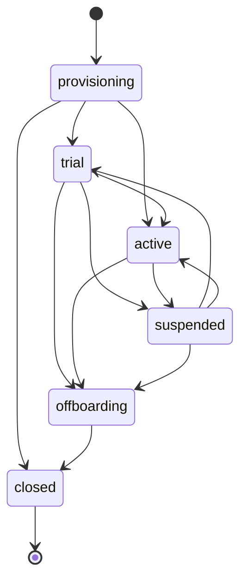

# Teknoloji Kararları ADR

Bu doküman, IK Platform için temel teknoloji kararlarını ADR formatında özetler.

## 1. ADR özeti

| ADR | Konu | Karar | Durum |
|---|---|---|---|
| ADR-001 | Backend | FastAPI + Python | Kabul |
| ADR-002 | Mimari | Modüler monolit | Kabul |
| ADR-003 | DB | PostgreSQL | Kabul |
| ADR-004 | Cache/queue | Redis | Kabul |
| ADR-005 | Web | Next.js + TypeScript | Kabul |
| ADR-006 | Mobil | Önce PWA/responsive, sonra Flutter opsiyon | Kabul |
| ADR-007 | Dosya | S3 uyumlu object storage | Kabul |
| ADR-008 | Async | Dramatiq + Redis hedef adapter; provider-neutral port/fake | Kabul |
| ADR-009 | Arama | MVP PostgreSQL FTS, V1 OpenSearch opsiyon | Kabul |
| ADR-010 | AI | AI Gateway + provider soyutlama | Kabul |
| ADR-011 | Deploy | Docker, ileride Kubernetes/Helm | Kabul |
| ADR-012 | Auth | Kendi auth + SSO entegrasyonu | Kabul |
| ADR-013 | Transaction/hata sınırı | Application command + Unit of Work, merkezi typed API mapping | Kabul |
| ADR-014 | Tenant ilişkisel bütünlüğü | Composite tenant foreign key + expand-contract | Kabul |
| ADR-015 | Concurrency/idempotency/arşiv | PostgreSQL receipt, tenant-scoped row lock, çalışan arşivi | Kabul |
| ADR-016 | Phase-0 sorgu performansı | Ölçümlü keyset, PostgreSQL trigram/normalize indexleri, aggregate consolidation; cache yok | Kabul |
| ADR-017 | Tenant lifecycle ve provisioning yüzeyi | Typed tenant/settings modeli, injected principal ile default-deny platform/tenant API, lifecycle-derived health | Kabul |
| ADR-018 | Request context ve API contract standardı | Immutable context, güvenli correlation middleware, yeni Faz-1 `{data, meta}` ve explicit Faz-0 adapter'ları | Kabul |
| ADR-019 | PostgreSQL tenant RLS ve DB capability yolları | Forced RLS, transaction-local tenant binding, HR'sız platform role | Kabul |
| ADR-020 | Typed tenant rollout ve platform event contracts | Allowlisted per-tenant flags, configured-limit-only queries, redacted UoW event seam | Kabul |
| ADR-021 | Phase-1 OpenAPI principal metadata ve review checkpoint | Truthful `x-required-principal`, credential şeması yok, Phase 2 öncesi insan review stop'u | Kabul |

## 2. ADR-001 Backend: FastAPI

Bağlam:

- API-first ürün.
- OpenAPI üretimi önemli.
- Entegrasyon, AI ve import/export yoğun.
- Python ekosistemi veri/AI tarafında güçlü.

Karar:

- FastAPI + Pydantic + SQLAlchemy/Alembic.

Sonuç:

- Auth, audit ve tenant guard gibi çapraz kesen işler bilinçli tasarlanmalıdır.
- Kod kalitesi için typed model ve test disiplini gerekir.

## 3. ADR-002 Modüler monolit

Karar:

- MVP/V1 için mikroservis değil, modüler monolit.
- Canonical sınırlar cross-cutting yetenekler için `app.platform`, ürün sahipliği için
  `app.modules.<module>` paketleridir.
- Geçiş artımlıdır: legacy paket yalnız canonical hedefi import/re-export edebilir; canonical paket
  legacy pakete geri bağımlı olamaz.
- Katman ve modül yönleri AST tabanlı import-boundary testiyle, bütün `app` import grafiği de cycle
  testiyle korunur. Yeni üçüncü taraf architecture dependency'si eklenmez.

Gerekçe:

- Küçük/orta ekip için operasyonel sadelik.
- Modüller arası transaction ihtiyacı.
- Ürün-pazar doğrulaması öncesi servis karmaşası gereksiz.

Sonuç:

- Presentation application'a; application domain/portlara; infrastructure application portlarına
  doğru bağımlanır. Domain FastAPI, Pydantic, SQLAlchemy, settings veya provider client import etmez.
- Platform ürün modülüne; bir ürün modülü başka modülün infrastructure/ORM katmanına bağımlanmaz ve
  başka modülün tablosuna doğrudan yazmaz.
- Mevcut flat `api/core/db/models/schemas/services` paketleri tek seferde taşınmaz. Compatibility
  importları public class/function identity'sini ve mevcut API davranışını korur.
- Generic repository, speculative DDD katmanı veya mikroservis ayrıştırması bu kararın parçası
  değildir.
- Payroll, AI, reporting ve integration worker ileride ayrışma adayıdır.

## 4. ADR-003 PostgreSQL

Karar:

- Ana veritabanı PostgreSQL.
- Uygulama runtime engine ve sessionmaker'ı FastAPI lifespan başlangıcında oluşturulur;
  sahiplik uygulamadadır ve engine kapanışta dispose edilir.
- Pool ve timeout değerleri ortam konfigürasyonudur:
  `IK_DATABASE_POOL_SIZE`, `IK_DATABASE_MAX_OVERFLOW`,
  `IK_DATABASE_POOL_TIMEOUT_SECONDS`, `IK_DATABASE_POOL_RECYCLE_SECONDS`,
  `IK_DATABASE_CONNECT_TIMEOUT_SECONDS`, `IK_DATABASE_STATEMENT_TIMEOUT_MS` ve
  `IK_DATABASE_IDLE_TRANSACTION_TIMEOUT_MS`.
- PostgreSQL 16 için server-side sınırlar `statement_timeout` ve
  `idle_in_transaction_session_timeout` ile uygulanır.
- Yayınlanmış migration kimliklerini değiştirmeden korumak için PostgreSQL Alembic
  `version_num` kolonu 128 karakterdir; 0006 migration'ı mevcut 32 karakterlik kolonları
  upgrade sırasında genişletir.
- Hızlı test hattı SQLite kullanır; persistence, migration ve PostgreSQL'e özgü iddialar
  gerçek PostgreSQL entegrasyon hattında kanıtlanır.
- PostgreSQL testleri birbirinin retained verisine veya collection sırasına bağımlı olmamalıdır;
  her `postgres` testi admin DSN üzerinden kendi disposable veritabanını oluşturur ve sonunda
  düşürür.
- Mevcut `users.email` unique sözleşmesi case-sensitive'dir. Auth uygulanmadan önce
  `lower(btrim(email))` ile uygulama ve DB'nin aynı canonical değeri kullandığı explicit normalize
  kolon/index migration'ı yapılacaktır; implicit karşılaştırma semantiği veren `citext` seçilmedi.

Gerekçe:

- Transaction güvenilirliği.
- RLS desteği.
- JSONB.
- FTS/trigram.
- Geniş ekosistem.
- pgvector opsiyonu.

Sonuç:

- Tenant izolasyonu DB seviyesinde de desteklenebilir.
- Büyük rapor ve analytics için ileride read replica/warehouse gerekebilir.
- Gizli/global cache'lenmiş engine yerine uygulama kapsamında açık sahiplik vardır; test ve
  shutdown akışları bağlantıları deterministik olarak kapatabilir.
- SQLite test engine'lerine PostgreSQL/QueuePool'a özgü parametreler uygulanmaz.
- Bu karar API/OpenAPI, auth, RBAC veya RLS davranışını değiştirmez.

## 5. ADR-004 Redis

Kullanım alanları:

- Cache.
- Rate limit.
- Session/denylist yardımcı verisi.
- Queue broker.

Karar:

- Redis kalıcı ana veri deposu değildir; kaybı tolere edilmeyen veri PostgreSQL'de kalır.
- Kritik HTTP komutlarının durable idempotency receipt ve response snapshot kayıtları ADR-015
  uyarınca PostgreSQL'de tutulur; Redis bu sözleşmenin kayıt sistemi değildir.

## 6. ADR-005 Next.js + TypeScript

Gerekçe:

- Admin panel, çalışan portalı, aday portalı ve kariyer sitesi tek teknolojiyle üretilebilir.
- SSR/SEO kariyer sitesi için avantaj sağlar.
- React ekosistemi güçlüdür.

Sonuç:

- TypeScript zorunlu olmalıdır.
- UI bileşenleri tasarım sistemiyle standardize edilmelidir.

## 7. ADR-006 Mobil strateji

Karar:

- MVP'de responsive web/PWA.
- Native mobil ihtiyaç doğrulanırsa Flutter.

Gerekçe:

- MVP kapsamını şişirmemek.
- Çalışan/yönetici kritik akışlarını önce PWA ile test etmek.
- Mavi yaka yoğun pilotlarda native ihtiyaç ayrıca ölçülür.

## 8. ADR-007 S3 uyumlu depolama

Kullanım:

- Özlük belgeleri.
- Bordro PDF.
- Export dosyaları.
- Import kaynak dosyaları.

Karar:

- Dosya DB içinde BLOB olarak tutulmaz.
- Metadata DB'de, içerik object storage'da tutulur.

## 9. ADR-008 Async worker

Bağlam:

- Worker provider kurulmadan önce Python 3.13, Redis, retry/timeout/dead-letter, tenant concurrency,
  async uyumu, gözlemlenebilirlik ve operasyonel sadelik birlikte değerlendirilmelidir.
- Bu karar provider'ı domain/application koduna sızdırmamalı ve Faz 0'da broker/deploy kurmamalıdır.

2026-07-10 spike özeti:

| Aday | Güçlü taraf | Bu proje için sınır |
|---|---|---|
| Dramatiq 2.2 | Python `>=3.10`, Redis broker, AsyncIO middleware, retry/backoff, time limit, dead-letter, Prometheus ve Redis concurrent rate limiter | Tenant limiti adapter/middleware anahtarında açıkça `tenant_id` ile kurulmalı; time limit bloklayan system call'u zorla kesme garantisi değildir |
| RQ 2.10 | Python 3.13 classifier, Redis/Valkey, düşük öğrenme/operasyon yükü, retry ve failed registry | Sync/fork ağırlıklı çalışma mevcut async SQLAlchemy akışına daha fazla köprü kodu getirir |
| Celery 5.6 | En olgun routing/retry/time-limit/event ekosistemi ve Redis desteği | MVP için daha geniş config/operasyon yüzeyi; coroutine adaptasyonu daha törensel |
| Taskiq 0.12 | Async-first, FastAPI uyumu, retry/timeout/Prometheus middleware | Core paket halen alpha classifier taşır ve Redis broker ayrı paket yaşam döngüsündedir |

Karar:

- MVP provider hedefi **Dramatiq 2.2 + Redis**'tir. Provider dependency'si, Redis broker config'i,
  worker process'i ve deploy tanımı Faz 0'da eklenmez; ilk gerçek adapter ihtiyaç duyulan vertical
  phase'de aynı ADR'nin operasyon kontrolleriyle uygulanır.
- Application kodu yalnız dar `JobQueue.enqueue(JobSpec)` portuna bağımlıdır. `JobSpec`, non-zero
  `tenant_id`, closed `JobOrigin.REQUEST|SYSTEM`, `idempotency_key`, finite JSON payload, pozitif
  timeout ve bounded-attempt niyetini zorunlu kılar. Queue provider idempotency'nin kayıt sistemi
  değildir; business/outbox kuralı ayrıca authoritative olmalıdır.
- `RecordingJobQueue` deterministik test fake'idir. Üretim davranışı veya in-process worker gibi
  sunulmaz. Request-origin job operational context olmadan kurulamaz ve context tenant'ı job
  tenant'ıyla exact eşleşir. System/outbox job'u explicit `SYSTEM` origin ile context'siz kurulur;
  request context taşıyamaz. Gerçek adapter transport tenant authority'sini doğrulayıp DB
  transaction'ına bind etmelidir.
- Import/export, bildirim ve rapor işleri background worker ile çalışacaktır. Bordro ve AI ürün
  işleri MVP dışıdır; portta var olmaları veya Faz 0'da task tanımlanmaları gerekmez.

Gerekçe:

- Uzun işlem HTTP request içinde tutulmaz.
- Retry, timeout, terminal failure/dead-letter, tenant concurrency ve izlenebilir status gerekir.
- Dramatiq bu kontrollere Redis ile hazır primitive'ler verirken Celery'den daha küçük operasyon
  yüzeyi ve RQ'dan daha doğrudan async actor yolu sunar.

Kanıt kaynakları:

- [Dramatiq 2.2 user guide](https://dramatiq.io/guide.html)
- [Dramatiq API reference](https://dramatiq.io/reference.html)
- [RQ 2.10 package metadata](https://pypi.org/project/rq/)
- [Celery package metadata](https://pypi.org/project/celery/)
- [Taskiq package metadata](https://pypi.org/project/taskiq/)

Sonuç:

- `app.platform.workers` provider-neutral contract ve fake içerir; runtime provider kurulumu yoktur.
- Her gerçek adapter, tenant concurrency key'ini `tenant_id`'den üretmeli, retry/timeout/DLQ
  mapping'ini contract testleriyle kanıtlamalı ve payload'da secret/PII taşımamalıdır.

## 10. ADR-009 Arama

Karar:

- MVP: PostgreSQL FTS/trigram.
- Employee dizini için case-insensitive literal substring sözleşmesi PostgreSQL `ILIKE` ve
  `pg_trgm` GIN indexleriyle uygulanır; isimler ve hassas alanlar bu arama kapsamına eklenmez.
- V1/V2: OpenSearch veya benzeri arama sistemi opsiyon.

Gerekçe:

- MVP'de ikinci sistem yükü azaltılır.
- ATS/CV ve doküman araması büyüyünce ayrı search gerekir.
- Kısa/düşük seçicilikli terimlerde PostgreSQL'in ölçerek sequential scan seçmesi hata sayılmaz;
  breaking minimum arama uzunluğu ayrıca ürün sözleşmesi olmadan eklenmez.

## 11. ADR-010 AI Gateway

Karar:

- Uygulama modülleri AI provider'a doğrudan çağrı atmaz.
- Tüm AI çağrıları AI Gateway veya merkezi AI modülünden geçer.

Neden:

- PII masking.
- Prompt versioning.
- Model/provider soyutlama.
- Cost/kota takibi.
- Audit.
- RAG ACL kontrolü.

## 12. ADR-011 Deploy stratejisi

MVP:

- Docker tabanlı deployment.
- CI/CD ile test ve lint.

V1/Enterprise:

- Kubernetes + Helm opsiyonu.
- Ayrı worker deployment'ları.
- Ortam bazlı config.

## 13. ADR-012 Auth stratejisi

Karar:

- Kendi auth/session/permission modeli.
- Enterprise'da SAML/OIDC/SCIM entegrasyonu.

Gerekçe:

- Field-level permission ve HR scope modeli hazır auth ürünlerinde tam karşılanmaz.
- Uygulama içi RBAC/ABAC zaten gerekli.

## 14. ADR-013 Application command transaction ve hata sınırı

Bağlam:

- Employee ve leave business servislerinin kendi `commit()` çağrıları, domain değişikliği
  ile ileride eklenecek audit/outbox kayıtlarını tek transaction'da birleştirmeyi engelliyordu.
- Route bazında tekrarlanan exception dönüşümleri DB integrity/concurrency hataları için
  kararlı ve merkezi bir API sözleşmesi sağlamıyordu.

Karar:

- Transitional `EmployeeCommandHandler` ve `LeaveRequestCommandHandler` write akışlarını
  orkestre eder; `SqlAlchemyUnitOfWork.execute` bu akışların tek transaction sahibidir.
- `EmployeeService` ve `LeaveRequestService` gerekli yerde `flush()` eder, hiçbir migrated command
  path'inde `commit()` etmez. Commit veya hata halinde rollback UoW sınırındadır.
- Lokal demo seed servisi de yalnız flush eder. Standalone `scripts/seed_demo_data.py` komutu
  `session_factory.begin()` ile seed'in tek commit/rollback sınırını dışarıdan sahiplenir.
- Read path'leri request-scoped `AsyncSession` ve optimize, SQLAlchemy-aware query/service kodunu
  doğrudan kullanır; read için UoW zorunlu değildir.
- Beklenen domain/application hataları HTTP bilgisi taşımayan `ApplicationError` tipleridir.
  API edge'deki merkezi mapper mevcut employee/leave code, status ve public mesajlarını korur.
- `uq_employees_tenant_employee_number` ihlali pre-check yarışında da mevcut
  `409 employee_number_conflict` sözleşmesine döner. Diğer bilinmeyen integrity hataları DB
  detayı sızdırmadan `409 data_integrity_conflict`; SQLAlchemy `StaleDataError` ve tanınan DB
  concurrency hataları `409 concurrent_write_conflict` döner.
- UoW yalnız transaction capability'sidir; SQLAlchemy API'sini yansıtan generic repository,
  modüller-arası veri erişim katmanı veya god object eklenmez.

Sonuç:

- Employee ve leave servislerinin flush ettiği değişikliklerin daha sonraki komut hatasında
  rollback olduğu fresh-session persistence testleriyle doğrulanabilir; ileride audit/outbox
  aynı session ve transaction'a eklenebilir.
- Bu karar schema/model değişikliği yapmaz ve Alembic migration gerektirmez.
- P0C tek transaction ve hata sınırını kurmuştur. Leave decision winner, idempotency ve çalışan
  arşivleme davranışı daha sonra P0E kapsamında ADR-015 ile bu sınır üzerinde uygulanmıştır.
- P0C tenant-owned composite foreign key katmanını değiştirmemiştir; bu katman daha sonra P0D'de
  ADR-014 ile uygulanmış ve mevcut tenant-scoped servis kontrolleri korunmuştur.
- AST architecture testi `app/services` altında `commit()` veya `rollback()` çağrısını reddeder;
  transaction completion yalnız açık application/script sınırında kalır.

## 15. ADR-014 Tenant ilişkisel bütünlüğü

Bağlam:

- Tenant-owned child tablolar `tenant_id` taşısa da yalnız global parent `id` kolonuna bağlanan
  scalar foreign key'ler doğrudan DB write, import veya bakım yolu üzerinden cross-tenant ilişki
  kurulmasına izin veriyordu.
- Uygulama guard'ı bu veri modelinin tek koruması olmamalıdır. RLS ise Faz 1 kapsamındadır ve ilişki
  bütünlüğü constraint'inin alternatifi değildir.

Karar:

- Başka tenant-owned tablolar tarafından referans verilen parent'ta `(tenant_id, id)` candidate
  key; child'da `(tenant_id, foreign_id)` composite foreign key zorunludur.
- Mevcut şemada `employees` ve `users` candidate key taşır. `leave_requests` employee/requester/
  decider ilişkileri ile `leave_balance_summaries` employee ilişkisi composite'tir. Requester ve
  decider nullability davranışı korunur; employee history ilişkilerinin silme politikası P0E ile
  ADR-015'teki `RESTRICT` kuralına geçirilmiştir.
- Geçiş iki revision expand-contract'tır: preflight + concurrent candidate index + `NOT VALID`
  composite foreign key; ardından validation + eski scalar foreign key removal. Downgrade önce eski
  constraint'i geri getirip validate eder.
- Root `tenant_id → tenants.id` foreign key'leri ve uygulama tenant guard'ları korunur. RLS Faz 1'e
  ertelenmiştir.
- SQLite yalnız hızlı metadata/migration uyumu sağlar. PostgreSQL concurrent index, validation ve
  doğrudan write iddiaları gerçek PostgreSQL 16 testleriyle kanıtlanır.

Sonuç:

- API servisi bypass edilse bile cross-tenant leave employee/user bağlantıları persist edilemez.
- Preflight bozuk mevcut veride constraint DDL'den önce fail olur; valid veri upgrade/downgrade
  boyunca korunur.
- Yeni tenant-owned ilişki tasarımında tenant kimliği foreign key'in ayrılmaz parçasıdır.
- Endpoint/OpenAPI, auth/RBAC ve ürün davranışı değişmez.

## 16. ADR-015 Concurrency, idempotency ve çalışan arşivi

Bağlam:

- Employee number availability pre-check'i tek başına eşzamanlı insert yarışını kapatmıyordu.
- İki bağımsız leave decision transaction'ı aynı `pending` kaydı okuyup çelişkili karar
  yazabiliyordu.
- Retry edilen kritik POST/decision komutları aynı domain kaydını birden fazla kez üretebiliyordu.
- Normal employee DELETE işlemi çalışanı ve bağlı izin/bakiye geçmişini fiziksel olarak
  silebiliyordu.

Karar:

- `uq_employees_tenant_employee_number` veritabanı constraint'i authoritative winner'dır. Named
  constraint ihlali, availability pre-check yarışında da kararlı `409 employee_number_conflict`
  sözleşmesine map edilir.
- Leave approve/reject/cancel komutları kaydı hem `tenant_id` hem resource id ile seçer ve
  PostgreSQL blocking `SELECT ... FOR UPDATE` row lock alır. İlk transaction terminal kararı
  commit eder; bekleyen transaction güncel status'u görüp mevcut
  `409 leave_request_transition_conflict` sözleşmesine düşer.
- Employee create, leave create ve leave approve/reject/cancel endpointleri opsiyonel
  `X-Idempotency-Key` kabul eder. Key namespace'i tenant genelidir: `(tenant_id, idempotency_key)`
  unique constraint'i aynı tenant içinde command'lar arasında da tek sahip seçer.
- İlk başarılı komut `command_idempotency` tablosunda command adı, canonical request fingerprint,
  resource id, tamamlanma zamanı ve response snapshot'ını domain write ile aynı Unit of Work
  transaction'ında saklar. Aynı key + aynı canonical command/target/body fingerprint'i
  snapshot'tan eşdeğer yanıtı replay eder; aynı key + farklı command, hedef resource veya body
  DB ayrıntısı sızdırmadan `409 idempotency_key_mismatch` döner. Create komutlarında ayrı
  target yoktur; leave decision fingerprint'i body yanında `leave_request_id` hedefini içerir.
- Receipt'ler için TTL/cleanup job henüz yoktur. Süreli silme davranışı ayrıca retention kararı ve
  güvenli worker uygulaması olmadan varsayılmaz.
- Normal employee DELETE compatibility route'u fiziksel delete yerine `employees.archived_at`
  yazar. Arşivli çalışan employee list/detail/update yüzeylerinden, yeni leave oluşturma ve normal
  leave-balance erişiminden gizlenir; dashboard workforce sorguları da arşivliyi saymaz. Aynı
  tenant'ta tekrarlanan DELETE no-op `204` döner.
- Employee number unique constraint'i arşivli kayıtları da kapsar; arşivleme identifier'ı yeniden
  kullanıma açmaz.
- `leave_requests` ve `leave_balance_summaries` employee composite foreign key'leri
  `ON DELETE RESTRICT` kullanır. Böylece servis atlanarak yapılan doğrudan employee hard delete,
  geçmiş varken veritabanında reddedilir ve geçmiş satırlar korunur.
- Public employee purge endpoint'i yoktur. Root `tenant_id → tenants.id` cascade yalnız kısıtlı
  operatör retention/offboarding prosedürü içindir; normal employee API'sinin silme yolu değildir.
- `0011` downgrade, archive marker veya idempotency receipt varken sessiz veri/semantik kaybına
  izin vermez; operatör export/remediation yapana kadar retention preflight ile durur.

Sonuç:

- Concurrent duplicate employee create için tam bir winner, concurrent leave decision için tek
  terminal sonuç ve retry edilen kritik komut için tek resource/receipt PostgreSQL testleriyle
  doğrulanır.
- Arşivli çalışan normal API yüzeyinde silinmiş gibi görünürken employee, leave request ve leave
  balance kayıtları retention amacıyla veritabanında kalır.
- Key'ler tenant'lar arasında çakışmaz; row lock ve archive sorguları tenant predicate'ini
  korur. Bu karar auth/RBAC veya RLS yerine geçmez.

## 17. ADR-016 Phase-0 pagination ve query-performance baseline

Bağlam:

- Employee ve leave listeleri yalnız offset kullanıyor, derin sayfalarda maliyet büyüyordu.
- Employee `q` sorgusu ordinary B-tree indexlerinin kullanamadığı case-normalized contains
  predicate'leri üretiyordu; department normalizasyonu da her satırda hesaplanıyordu.
- Dashboard varsayılan yanıtta dört ayrı count dahil toplam yedi sıralı SQL statement çalıştırıyordu.
- Mevcut plain-array response sözleşmesini Faz 1 `{data, meta}` zarfına erken geçirmek uyumluluğu
  bozardı.

Karar:

- Employee listesi `(employee_number asc, id asc)`, leave request listesi
  `(created_at desc, start_date asc, id asc)` üzerinden versioned opaque keyset cursor kullanır.
  Response body plain array kalır; devam değeri `X-Next-Cursor` header'ındadır. Bounded `offset`
  deprecated compatibility path olarak korunur; positive offset ile cursor birlikte reddedilir.
- Cursor tenant kimliği veya yetki taşımaz. Tenant filtresi her sorguda cursor'dan bağımsızdır.
- `0012_p0f_query_performance`, PostgreSQL'de `pg_trgm` extension'ını hazırlar ve arşivli olmayan
  employee number/email için partial GIN indexleri ekler. Downgrade ortak kullanılabilecek
  extension'ı düşürmez.
- Department için `lower(ltrim(rtrim(department)))` stored generated kolonu ve non-archived
  kayıtlarla sınırlı `(tenant_id, department_normalized)` B-tree indexi kullanılır. Böylece exact
  case-insensitive filtre satır başına expression çalıştırmaz ve geçmiş whitespace davranışı
  korunur.
- Leave keyset sırasını karşılayan
  `(tenant_id, created_at desc, start_date asc, id asc)` indexi eklenir.
- Dashboard active/current/new-starter sayıları ile pending-leave scalar subquery'si tek statement
  olur. Query count varsayılan akışta 7'den 4'e, activity kapalıyken 5'ten 2'ye iner.
- 10,000 employee + 5,000 leave fixture'ı `VACUUM (ANALYZE)` sonrası gerçek PostgreSQL 16'da
  `EXPLAIN (ANALYZE, BUFFERS, FORMAT JSON)` ile kontrol edilir. Index adı/row bound/query count
  ve cursor `rows removed` sınırı regression gate'tir; donanıma duyarlı elapsed time CI pass/fail
  eşiği değildir.
- Redis/cache eklenmez. Cache ancak tekrar ölçüm query/index iyileştirmelerinin yetmediğini
  gösterirse ve tenant/role/scope invalidation sözleşmesi hazırsa yeniden değerlendirilir.

Sonuç:

- Büyüyen listeler stable ordering key'lerinde offset kaymasına bağlı duplicate/skip riskini
  azaltan deterministic keyset devam yoluna sahiptir; mevcut offset kullanan istemciler çalışmaya
  devam eder. Cursor bir snapshot garantisi vermez; cursor öncesine eklenen veya ordering key'i
  değişen satırlar sonraki sayfalarda yeniden konumlanabilir.
- Selective employee search planı trigram indexlerini, deep employee/leave cursor planları ilgili
  B-tree indexlerini kullanır. Full-tenant dashboard aggregate'inde planner'ın sequential scan
  seçmesine izin verilir.
- OpenSearch, response envelope standardizasyonu, audit-derived dashboard activity ve cache
  invalidation bu Phase-0 kararının kapsamı değildir.

Kanıt ve tekrar prosedürü:

- [Phase 0 Query Performance Baseline](../09-uygulama/12-phase-0-query-performance-baseline.md)

## 18. ADR-017 Tenant lifecycle, typed settings ve platform provisioning

Bağlam:

- Faz 1'in ilk dikey kesiti tenant provisioning, metadata ve tenant ayarlarını görünür bir API
  yüzeyiyle sunmalıdır; platform operatörüne employee, leave veya başka müşteri iş verisi açmamalıdır.
- Authentication/session/RBAC Faz 2 işidir. Bu nedenle bir header veya request body'sindeki
  `tenant_id`/user ID değerini yetki kanıtı saymak, geçici bile olsa güvenli bir temel değildir.
- Serbest biçimli JSON ayarları şema dışı anahtar, tip ve doğrulama davranışını kalıcılaştırır.
  Tenant ayarlarının ilk allowlist'i ürün sözleşmesi ve ilişkisel şema ile aynı olmalıdır.
- F1A checkpoint'inde request context ve standart `{data, meta}` zarfı yoktu. Mevcut response
  uyumluluğunu o dikey kesitte kırmama kararı historical'dır; ADR-018 F1B migration sınırını
  sonradan açıkça tanımlar.

Karar:

- F1A yalnız şu yedi operation'ı ekler:
  `POST/GET /api/v1/platform/tenants`,
  `GET/PATCH /api/v1/platform/tenants/{tenant_id}`,
  `GET /api/v1/tenant` ve
  `GET/PATCH /api/v1/tenant/settings`.
  `/api/v1/tenant/features` veya başka feature-flag endpoint'i bu kesitte yoktur.
- Platform route'ları yalnız trusted upstream adapter tarafından enjekte edilen immutable
  `PlatformPrincipal`; tenant route'ları yalnız immutable `TenantPrincipal` ile çalışır.
  Production/default dependency her iki yüzeyde de fail-closed davranır. Testler Phase 2 auth
  gelene kadar dependency override kullanabilir. Header, query, path veya body içindeki user/tenant
  ID hiçbir zaman bu principal'ları oluşturmaz veya authorization sağlamaz.
- F1A checkpoint'inde success response'ları doğrudan typed object/list dönmüştür. ADR-018, tam bu
  yedi operation'ı F1B'de intentional `{data,meta}` migration'a alır; Faz-0 employee/leave
  uyumluluğunu ise explicit adapter'larla korur.
- Canonical create/PATCH plan kodları `core`, `professional`, `enterprise`; data region değerleri
  `tr-1`, `eu-1`; locale değerleri `tr-TR`, `en-US` olarak allowlist edilir. Pre-F1A `premium`
  plan satırları list/detail/current response'larında read-only compatibility olarak tanınır,
  ancak create/PATCH `premium` kabul etmez ve migration bunları sessizce yeniden yazmaz. Timezone
  geçerli bir IANA timezone adı olmalıdır. `data_region` yalnız tenant `provisioning` durumundayken
  değiştirilebilir; sonrasında lifecycle veya plan değişikliği region relocation anlamına gelmez.
- `tenant_settings` bir arbitrary JSON blob değildir. `tenant_id` aynı zamanda primary key ve
  `tenants.id` için `ON DELETE CASCADE` foreign key'dir. Fixed kolonlar yalnız
  `week_start_day` (`monday|sunday`),
  `date_format` (`DD.MM.YYYY|MM/DD/YYYY|YYYY-MM-DD`) ve
  `time_format` (`24h|12h`) değerlerini taşır; `locale` ve `timezone` tenant'ın typed temel
  kolonlarında canonical tutulur. Tenant settings API'sinin allowlist'i tam olarak
  `locale`, `timezone`, `week_start_day`, `date_format`, `time_format` anahtarlarıdır;
  `extra="forbid"` semantiğiyle key/value ekleme kabul edilmez.
- Tenant provisioning tenant satırı ile default settings satırını tek transaction'da oluşturur.
  Mevcut tenant'lara migration sırasında sırasıyla `monday`, `DD.MM.YYYY`, `24h` defaultlarıyla
  bir settings satırı backfill edilir. `0013` downgrade custom settings'i sessizce kaybetmez:
  default dışı satır sayısını `custom_tenant_settings` olarak raporlayıp export/default restoration
  yapılana kadar fail eder; yalnız tüm satırlar default iken tablo kaldırılabilir.
- Lifecycle aynı-state idempotent no-op dahil aşağıdaki directed graph'tır. Listelenmeyen her
  transition reddedilir:

Lifecycle erişim ve platform health matrisi:

| Tenant status | F1A current/settings yüzeyi | Platform `health` | Kural |
|---|---|---|---|
| `provisioning` | `platform_only` | `provisioning` | `/tenant` ve settings erişimi kapalıdır; provisioning platformdan tamamlanır |
| `trial` | `read_write` | `healthy` | Current/settings GET ve settings PATCH açıktır |
| `active` | `read_write` | `healthy` | Current/settings GET ve settings PATCH açıktır |
| `suspended` | `read_only` | `restricted` | Current/settings GET açıktır; settings PATCH reddedilir |
| `offboarding` | `read_only` | `offboarding` | Current/settings GET açıktır; settings PATCH reddedilir; export/retention orkestrasyonu F1A dışıdır |
| `closed` | `denied` | `closed` | Current/settings erişimi reddedilir; platform lifecycle metadata'sı görülebilir |

Phase-0 employee/leave/dashboard route'larının caller-header compatibility davranışı F1A içinde
genişletilmez veya lifecycle authorization gibi sunulmaz. Bu header principal üretmez. Phase 2
authenticated request context'i devreye alırken lifecycle policy protected business route'larına
merkezi olarak compose edilir; F1A testi yalnız yeni injected-principal current/settings yüzeyini
ve pure domain policy'yi sabitler.

- Platform list/detail response'u yalnız tenant kimliği, slug/name, lifecycle, plan, region,
  locale/timezone, timestamps ve lifecycle'dan deterministik türetilen `health` metadata'sını
  taşır. Health sorgusu employee/leave tablolarını saymaz veya join etmez; HR count, record,
  payload, document, leave ya da sensitive customer data platform response'una eklenemez.

Sonuç:

- Yeni/update tenant status, plan, locale ve region inputları API/domain'de typed allowlist ile
  sınırlıdır; mevcut legacy tenant satırları yeniden yorumlanmaz. İlişkisel şemada mevcut status
  check'i korunur, yeni settings değerleri named check constraint'lerle sınırlanır; IANA timezone
  doğrulaması application boundary'sindedir.
- Settings PATCH partial update'tir fakat yalnız sabit allowlist'i kabul eder. Tenant principal'ın
  tenant scope'u dependency'den gelir ve path/body ile değiştirilemez; cross-tenant negatif test bu
  kuralı sabitler.
- `0013_tenant_settings` SQLite ve PostgreSQL için data-preserving upgrade/downgrade/upgrade
  round-trip, existing-tenant backfill ve custom-settings downgrade refusal sağlamak üzere
  tasarlanmıştır. Bu davranış ve PostgreSQL'e özgü iddialar gate tamamlanmadan kabul edilmiş
  sayılmaz; gerçek PostgreSQL lane'inde doğrulanır.
- F1A auth/session/RBAC, audit persistence/event recorder, PostgreSQL RLS, feature flags,
  legal entity, support/break-glass erişimi veya daha sonraki ürün modülü eklemez. Bu ADR,
  Phase 2 kimlik doğrulamasının yerine geçmez; yalnız güvenli injection seam ve fail-closed
  başlangıç davranışını tanımlar.
- F1A lifecycle/settings, generated OpenAPI, SQLite ve PostgreSQL 17.10 gate'leri tamamlanmıştır.

## 19. ADR-018 Immutable RequestContext, correlation ve API contract standardı

Bağlam:

- HTTP request/trace kimlikleri merkezi bir doğrulama/üretim sınırına sahip değildi; caller'ın ham
  correlation header'ı bazı hata body'lerinde doğrudan kullanılabiliyordu.
- Tenant, gelecekteki actor/session ve support-session metadata'sını application katmanlarına
  taşımak için tek bir immutable request modeli yoktu.
- F1A'nın yedi yeni platform/tenant operation'ı geçici olarak direct typed object/list dönüyordu;
  platform listesi offset kabul ediyordu. Buna karşılık Faz-0 employee/leave client'larının
  plain-array ve `X-Next-Cursor` sözleşmesini sessizce kırmak kabul edilemezdi.
- Provider-neutral worker fake'i tenant-aware idi fakat HTTP request context'inden türetilmiş sabit,
  JSON-safe bir propagation allowlist'i doğrulamıyordu.

Karar:

- Canonical `RequestContext`, `frozen=True` ve `slots=True` dataclass'tır. `request_id`, `trace_id`,
  optional immutable `TenantContext`, actor/session UUID placeholder'ları, typed authentication
  strength ve optional immutable support-session metadata'sı taşır. Alan assignment'ı mümkün
  değildir; trusted enrichment aynı correlation kimliklerini koruyan yeni bir instance üretir.
- F1B authentication yapmaz. Authentication strength başlangıçta `unauthenticated` değeridir;
  actor/session/support alanları Faz 2 adapter'ları için typed placeholder'dır ve tek başına
  authorization, RBAC veya audit kaydı sağlamaz.
- Global ASGI middleware her HTTP isteğinde context'i request state'e bağlar. `X-Request-Id`, en
  fazla 128 karakterlik safe opaque token; `X-Trace-Id`, sıfır olmayan 32 lowercase hex token'dır.
  `X-Correlation-Id`, request ID'nin deprecated compatibility alias'ıdır. Request/correlation
  birlikteyse ancak tekil, geçerli ve eşit olduklarında korunur.
- Eksik, invalid, duplicate, çelişkili, e-posta/PII syntax'ı veya JWT biçimi taşıyan ID inputları
  canonical server ID'siyle değiştirilir. Ham değer response'a yansıtılmaz veya structured
  completion log'una yazılmaz. Response'taki olası upstream correlation header'ları kaldırılır ve
  tam olarak birer canonical `X-Request-Id`, `X-Trace-Id`, `X-Correlation-Id` eklenir.
- Public error correlation kaynağı context'tir. Structured log allowlist'i request/trace,
  authentication strength, optional tenant/support-session ID ve HTTP method/status ile sınırlıdır;
  actor ID, end-user session ID, support operator actor ID, tenant slug, PII, secret ve raw auth
  materyali metadata'ya eklenmez.
- F1A ile eklenen yedi platform/tenant success operation'ı intentional F1B contract migration ile
  `{data, meta}` döner. Tekil meta `request_id`, `trace_id`, deprecated body alias'ı
  `correlation_id`; liste meta'sı ayrıca `limit`, `next_cursor` taşır. Body ve response header
  correlation değerleri aynı context'ten üretilir.
- Yeni platform tenant listesi yalnız `limit` (`1..200`, default `50`) ve opaque `cursor` kabul
  eder; deterministic keyset sırası `(created_at asc, id asc)`'dir. Offset bu yeni endpointte
  reddedilir ve continuation `meta.next_cursor` içindedir.
- Faz-0 employee ve leave-request listeleri explicit `phase0_plain_cursor_list` adapter'ı üzerinden
  plain array + `X-Next-Cursor` döndürmeye devam eder. Bounded `offset` yalnız bu compatibility
  yolunda deprecated olarak kalır. Faz-0 error body correlation davranışı da ayrı compatibility
  seçimiyle korunur; bu sözleşmeler version/deprecation kararı olmadan zarf içine alınmaz.
- HTTP request kaynaklı tenant-scoped background context'i fixed JSON allowlist ile serialize
  edilir:
  `request_id`, `trace_id`, `tenant_id`, optional actor/session UUID'leri, authentication strength
  ve optional support-session/operator UUID'leri. Tenantless context fail closed olur; job tenant
  ID'si context tenant ID'siyle, legacy `correlation_id` ise request ID ile eşleşmek zorundadır.
  Extra/free-text key, tenant slug, token veya credential kabul edilmez. F1E'de explicit
  `JobOrigin.REQUEST` bu context'i zorunlu kılar; `JobOrigin.SYSTEM` ise request context'i reddeder
  fakat non-zero job tenant ID'sini hiçbir zaman atlayamaz.
- Generated OpenAPI yeni success envelope modellerini, üç safe response header'ını, platform
  listenin cursor-only query'sini ve Faz-0 listelerinin explicit deprecated compatibility
  sözleşmesini gösterir. Smoke aynı header/body correlation'ını, deterministic cursor traversal'ı,
  unsafe inputun yansıtılmamasını ve documented endpoint registry'sini kontrol eder.
- Bu karar schema veya Alembic migration eklemez.

Sonuç:

- Route/service kodu request context'i mutate edemez; tenant veya ilerideki identity enrichment
  açık ve test edilebilir bir replacement sınırından geçer.
- Correlation metadata observability için kullanılabilirken caller-controlled PII, JWT, secret veya
  raw authorization materyali error/log/response yüzeyine taşınmaz.
- Yeni Faz-1 endpointleri bounded ve deterministik contract standardına geçer; mevcut employee ve
  leave istemcileri sessiz bir breaking response değişikliğine uğramaz.
- F1B auth/session doğrulaması, RBAC/permission enforcement, audit persistence, PostgreSQL RLS,
  broker/worker runtime veya yeni ürün modülü başlatmaz. Bunlar kendi faz ve ADR/gate'lerinde ele
  alınır.

## 20. ADR-019 PostgreSQL RLS ve transaction-local tenant binding

Bağlam:

- Uygulama servisleri bütün sorgulara tenant predicate'i eklese de raw SQL, yeni repository,
  bakım kodu veya unutulan filtre için veritabanı seviyesinde satır izolasyonu yoktu.
- Tek runtime login/session factory platform metadata operasyonları ile tenant HR operasyonlarını
  aynı database yetkisiyle çalıştırıyordu. Table-owner/superuser bağlantısı RLS kanıtı olamaz.
- Command UoW açık transaction sahibiyken read servisleri SQLAlchemy autobegin kullanır. Yalnız
  command yoluna tenant GUC eklemek GET/dashboard sorgularını korumazdı.
- Connection-level tenant ayarı pool reuse sırasında başka request'e sızabilir; SQLite bu davranışı
  veya PostgreSQL role/policy catalog'unu kanıtlayamaz.

Karar:

- `0014_f1c_postgresql_rls`, frozen inventory'deki `users`, `employees`, `leave_requests`,
  `leave_balance_summaries`, `command_idempotency`, `tenant_settings` tablolarında RLS'yi
  `ENABLE` ve `FORCE` eder. Tenant app rolünün global metadata root'undan başka tenant keşfetmemesi
  için `tenants` da `id` üzerinden aynı tenant policy'sini taşır.
- Normal capability `wealthy_falcon_app`; platform metadata capability
  `wealthy_falcon_platform` rolüdür. İkisi de `NOLOGIN`, `NOINHERIT`, `NOSUPERUSER`,
  `NOCREATEDB`, `NOCREATEROLE`, `NOBYPASSRLS`'dir. Runtime login ayrı `NOINHERIT` gateway'dir;
  table owner/migration login'i HTTP runtime olarak kullanılmaz.
- App policy hem `USING` hem `WITH CHECK` tarafında
  `tenant_id = nullif(current_setting('app.tenant_id', true), '')::uuid` kullanır. `tenants`
  root'unda sol kolon `id`'dir. Missing/empty context hiçbir satır göstermez; malformed UUID
  sorguyu durdurur. Sıfır UUID application sınırında reddedilir.
- Platform role `tenants` üzerinde metadata SELECT/INSERT/UPDATE ve provisioning için
  `tenant_settings` INSERT-only policy/grant alır; settings SELECT/UPDATE verilmez. Normal app'in
  tenant-root update yetkisi locale/timezone ve ORM `updated_at` kolonlarıyla sınırlıdır;
  lifecycle/plan/region/name/slug platform-controlled kalır. Employee, user, leave, balance ve
  idempotency tablolarına platform grant/policy verilmez. Platform API bu capability'yi açık
  dependency yolundan seçer; tenant session'ıyla karıştırılması session-lifetime immutability
  guard'ı ile reddedilir.
- Tenant transaction önce `SET LOCAL ROLE wealthy_falcon_app`, ardından
  `SET LOCAL app.tenant_id = '<uuid>'` çalıştırır. Platform transaction yalnız kendi local role'ünü
  seçer. UoW connection'ı operation'dan önce materialize ederek binding'i garanti eder; implicit
  read transaction'ları aynı `after_begin` hook'unu kullanır. Managed session context'siz başlarsa
  app role'e düşürülür fakat tenant GUC set edilmez.
- `SET LOCAL` role ve GUC commit/rollback ile sıfırlanır. Aynı fiziksel pool connection'ı üzerinde
  A → missing → B, commit ve rollback senaryoları gerçek PostgreSQL testiyle doğrulanır.
- Alembic helper identifier ve privilege allowlist'i doğrular; her revision tablo inventory'sini
  sabitler. Reused capability rolünün başka bir parent role üyeliği varsa upgrade daha geniş role
  geçiş riskini sessizce korumak yerine preflight'ta durur. Downgrade bu database'in
  policy/grant/RLS nesnelerini kaldırır fakat cluster-global, başka database tarafından
  kullanılabilecek capability rollerini düşürmez.
- SQLite migration/runtime yolu no-op'tur ve mevcut hızlı suite'i korur. Catalog discovery,
  role attributes, raw cross-tenant read/write, invalid/missing context, platform HR denial,
  repository ve pool reset iddiaları yalnız disposable PostgreSQL lane'inde kabul edilir.
- API/OpenAPI operation veya response contract değişmez. F1C authentication, RBAC, audit
  persistence, support/break-glass, worker provider ya da yeni HR modülü başlatmaz.

Sonuç:

- Application predicate, composite tenant foreign key ve forced RLS birbirini tamamlayan üç ayrı
  savunma katmanıdır.
- Platform tenant provisioning/list/detail devam ederken platform database capability'si müşteri
  HR tablolarını sorgulayamaz.
- Gelecekte eklenen her non-null `tenant_id` tablosu kendi migration'ında policy/grant almazsa
  bağımsız catalog inventory testi fail eder.
- Gerçek worker adapter'ı tenant-required envelope'dan aynı transaction binder'ı kurmadan HR
  persistence çalıştıramaz; mevcut fake cross-tenant context eşitliğini fail closed doğrular.

## 21. ADR-020 Typed tenant rollout, platform metadata query ve redacted event contracts

Bağlam:

- Phase 1 platform operations yüzeyi plan/status/health metadata'sını gösteriyordu ancak internal
  module rollout katalogu ve `/api/v1/tenant/features` uygulanmamıştı. Customer-specific kod fork'u
  veya arbitrary string flag kalıcı bir ürün/güvenlik açığı oluştururdu.
- Platform detail/list response'unda configured plan limiti gerekliydi; bunu employee count/usage
  sorgusuyla üretmek platform capability'sini HR tablolarına bağlar ve müşteri verisi sızıntısı
  riski yaratırdı.
- F1A command UoW seam'i vardı fakat Phase 1 tenant create/status/setting/flag değişiklikleri için
  Phase 2 append-only audit recorder'ının tüketebileceği kapalı/redacted sözleşmeler yoktu. Bir
  generic metadata dict erken audit-center/payload şeması yaratır ve parola/token/HR verisinin
  platform olayına taşınmasına izin verirdi.
- F1C platform ve tenant PostgreSQL capability'lerini ayırmıştı. Yeni tenant-owned flag tablosunun
  aynı forced-RLS ve least-privilege yaklaşımını kendi revision'ında genişletmesi gerekiyordu.

Karar:

- CORE domain flag katalogu ordered ve code-owned'dır: `organization`, `employees`, `documents`,
  `leave`, `self_service`, `reporting`, `notifications`. Deployed Phase-0 modülleri olduğu için
  yalnız `employees`, `leave`, `reporting` default `true`; diğerleri `false`'tur. Unknown key,
  per-customer schema ve customer-specific branch reddedilir.
- `0015_f1d_feature_flags`, tenant-owned assignment/override state'i taşıyan
  `tenant_feature_flags(tenant_id,key,enabled,timestamps)` tablosunu ekler. `(tenant_id,key)` primary
  key, tenant-root named cascade FK ve frozen key/boolean check'leri vardır. Migration anındaki
  existing tenant'lar revision'ın yedi frozen default satırıyla backfill edilir; daha sonra
  provision edilen tenant aynı yedi default satırı tenant/settings write'ıyla aynı UoW'da alır.
- F1C tenant root'ta table owner'a da FORCE RLS uygular. F1D upgrade backfill'i ve downgrade limit
  preflight'ı, migration owner'ın superuser/BYPASSRLS olduğunu varsaymadan transaction içinde
  tenant-root RLS flag'lerini geçici kaldırır ve `ENABLE + FORCE` durumunu geri kurar. Ayrı gerçek
  PostgreSQL testi `NOSUPERUSER NOBYPASSRLS` owner ile backfill, refusal ve restoration'ı doğrular.
- PostgreSQL'de feature tablosu RLS `ENABLE + FORCE` edilir. Tenant capability kendi policy'si
  altında yalnız `SELECT`; platform capability unrestricted platform policy'si altında yalnız
  `SELECT/INSERT/UPDATE` alır. İki capability'ye de `DELETE` verilmez. F1C historical migration
  inventory'si yeniden yazılmaz; F1D kendi policy/grant DDL'ini taşır. Hostile migration-owner
  default ACL'leri `PUBLIC` ve iki capability için önce revoke edilir, sonra exact grant uygulanır.
- Aynı revision `tenants.active_employee_limit` nullable integer metadata kolonunu, `1..1_000_000`
  named check'iyle ekler. HTTP contract bu değeri `limits.active_employees` altında gösterir.
  Bu configured limit, active employee usage/count değildir; `null` da ölçülmüş limitsiz kullanım
  anlamına gelmez.
- Downgrade ancak bütün feature row'ları frozen defaultlarda ve configured active employee limit
  sayısı sıfırken çalışır. Aksi durumda override/limit sayılarını raporlayarak revision ve veriyi
  yerinde bırakır.
- F1D üç additive operation ekler:
  `GET/PATCH /api/v1/platform/tenants/{tenant_id}/features` ve
  `GET /api/v1/tenant/features`. Böylece current generated OpenAPI 24 operation, runtime
  `/openapi.json` ile documented registry 25 endpoint'tir. Historical Phase-0/F1A/F1B snapshotları
  değiştirilmez; F1D ayrı intentional contract diff'idir.
- Feature response fixed katalog sırasında tam yedi item taşır. Her item typed `key`, boolean
  `enabled` ve `source=default|override` alanlarından oluşur. Platform PATCH non-empty, unique-key,
  strict-boolean allowlist kabul eder. Tenant feature GET tenant ID'yi injected principal/context'ten
  alır; tenant caller platform feature route'unu authorize edemez.
- Platform tenant list/detail, ORM entity veya HR aggregate döndürmek yerine dedicated query service
  ile yalnız `tenants.id/slug/name/status/plan_code/data_region/locale/timezone/active_employee_limit/
  created_at/updated_at` kolonlarını project eder. Health lifecycle'dan türetilir. Query service HR
  model import etmez, HR tablosuna join/count yapmaz; response employee/user/leave/document record
  veya usage sayacı taşımaz.
- Lifecycle hardening, `offboarding` veya `closed` transition'ının metadata/limit değişikliğiyle aynı
  PATCH'te birleştirilmesini reddeder. Closed terminal ve offboarding closure-only kuralları korunur;
  same-value/status/flag update actual change event üretmez.
- CORE application tam olarak dört Pydantic event sözleşmesine sahiptir: `tenant.created`,
  `tenant.status_changed`, `tenant.setting_changed`, `feature_flag.changed`. Modeller frozen ve
  `extra="forbid"`'dır; safe request/trace, non-zero UUID, timezone-aware occurrence, tenant scope,
  tenant resource/action, allowlisted actor kind/opaque actor-session placeholders ve fixed
  platform category/result/classification/visibility taşır.
  `tenant.setting_changed` yalnız non-empty unique changed-field tuple; flag event yalnız typed key
  ve strict before/after boolean taşır. Generic payload/metadata/before-data/after-data, parola/hash/
  token/OTP/secret ve employee/HR/sensitive data alanları yapısal olarak yoktur.
- `app.platform.events` ürün modülünü import etmez; framework-neutral primitive, nominal
  `PlatformEventContract` marker'ı, dört frozen kimlikle sınırlı exact-type registry ve async
  `PlatformEventRecorder` portunu sağlar. Recorder adapter'ları marker'ın kendisini, aynı property
  adlarını taşıyan structural nesneyi ve secret/HR alanı ekleyen subclass'ı reddeder. Phase 1 default adapter
  event'i discard ederek persistence iddiasında bulunmaz. Command handler actual event'i domain
  write ile aynı UoW callback'i içinde recorder'a verir; Phase 2 adapter'ı aynı-session append-only
  write ile değiştirebilir.
- F1D `audit_events` tablosu, audit retention/indexi, audit query API'si veya platform/tenant audit
  center eklemez. Bunlar ADR/master plan uyarınca Phase 2'dir.

Sonuç:

- Module rollout tenant-aware ve typed'dır; customer customization aynı codebase/catalog üzerinden
  yapılır. Tenant ve platform principal/DB capability sınırları ayrı kalır.
- Plan/limit/health/feature operasyon metadata'sı platforma görünürken customer HR record veya usage
  sorgusu platform path'ine girmez.
- Dört exact event Phase 2 atomik recorder'ına hazırdır fakat Phase 1, kalıcı audit izi varmış gibi
  davranmaz. Recorder hatası UoW callback'ini fail ettirebildiği için ileride audit write başarısızlığı
  domain write ile birlikte rollback edilebilir.
- SQLite migration/API tests portable contract kanıtıdır. RLS, grants, raw cross-tenant erişim ve
  platform-HR denial iddiaları gerçek PostgreSQL F1D lane'i yeşil olmadan tamamlanmış sayılmaz.
  Final Ruff/pytest/PostgreSQL/smoke ve exact OpenAPI snapshot sonuçları implementation-status
  belgesine yalnız çalıştırıldıktan sonra yazılır.

## 22. ADR-021 Phase-1 OpenAPI principal metadata ve review checkpoint

Bağlam:

- F1A-F1D sonunda altı platform ve dört current-tenant operation default-deny injected principal
  dependency'siyle korunuyordu. Generated OpenAPI `403` sözleşmesini açıklasa da hangi trusted
  principal türünün gerektiğini makine-okunur operation metadata'sıyla göstermiyordu.
- Faz 1'de request'ten doğrulanan token, session veya başka caller credential yoktur. Standard
  OpenAPI `security` alanı ancak gerçek bir `securityScheme` ve transport credential davranışıyla
  anlamlıdır; sahte bearer/OAuth şeması Phase-2 authentication uygulanmış gibi yanlış sözleşme
  üretirdi.
- Phase-1 gate'i endpoint görünürlüğünün yanında authorization denial, PostgreSQL RLS/direct-DB
  izolasyonu, platform payload minimizasyonu, correlation redaction ve exact contract evidence'ını
  birlikte kapatmalı; ardından Phase 2 otomatik başlamamalıdır.

Karar:

- Mevcut on Faz-1 operation generated OpenAPI'de required `x-required-principal` vendor extension'ı
  taşır. `POST/GET /api/v1/platform/tenants`, platform tenant detail `GET/PATCH` ve platform feature
  `GET/PATCH` için değer `platform`; current tenant `GET`, settings `GET/PATCH` ve feature `GET` için
  değer `tenant`tır.
- Extension yalnız trusted dependency seam'inin beklediği principal sınıfını belgeler. Header, path,
  query veya body içindeki tenant/user değeri authorization değildir; extension da caller'a yeni
  credential veya permission vermez. Runtime default dependencies principal olmadan fail closed
  kalır ve ters principal türü diğer yüzeyi açmaz.
- Gerçek authentication Phase 2'ye ait olduğu için bu on operation standard OpenAPI `security`
  alanı taşımaz ve schema top-level `components.securitySchemes` içermez. Faz 2 gerçek credential
  transport'u ve permission catalogunu uyguladığında standard security metadata'sını ayrı,
  intentional contract migration ile ekleyecektir; `x-required-principal` buna vekil sayılmaz.
- F1E OpenAPI snapshot'ı operation sayısını veya path setini değiştirmez; yalnız bu on operation'ın
  documentation digest'i değişir. Historical Phase-0/F1A/F1B/F1D snapshotları immutable kalır;
  F1D schema components ve OpenAPI top-level digest'i F1E'de birebir korunur.
- Contract/runtime testleri tam on-operation metadata matrisini, authorized test context'te
  çalışabilirliği, principal yokluğunda default denial'ı, tenant/platform principal ayrımını ve
  spoofed caller identity'nin etkisizliğini birlikte kanıtlar.
- Worker-fake gate'i mandatory job tenant scope'u ve closed `JobOrigin.REQUEST|SYSTEM`
  provenance'ını korur. Request-origin job context'siz kurulamaz; request-derived A tenant
  context'iyle B tenant job'u ve ters yön fake enqueue öncesinde reddedilir. Context'siz job yalnız
  explicit `SYSTEM` origin ile kurulabilir ve request context taşıyamaz. Bu kanıt gerçek broker,
  credential/signature veya worker DB adapter'ı varmış gibi sunulmaz; onlar ilgili
  vertical/provider fazının fail-closed yükümlülüğüdür.
- Platform operation response'ları yalnız allowlisted tenant lifecycle/plan/region/locale/timezone,
  configured limit ve typed rollout metadata'sı taşır. Employee, leave ve document payload alanı,
  customer record/schema/count/usage veya document content alanı sıfırdır. Rollout anahtar adı ve
  configured `limits.active_employees` HR payload'u veya kullanım sayacı olarak yorumlanmaz.
- Error fixture'ları safe correlation alias'ını, completion log fixture'ları safe request/trace
  alanlarını ve frozen platform event fixture'ları doğrulanmış request/trace alanlarını taşır. Event
  contract'ı arbitrary payload/metadata/before/after, credential, PII ve employee/leave/document
  alanlarını yapısal olarak reddeder; Phase 1 default recorder discard etmeye devam eder.
- F1E gate'inin çalıştırılmış exact Ruff, fast/PostgreSQL, Alembic round-trip/drift, RLS/direct-DB,
  OpenAPI, smoke ve git-hygiene komut sonuçlarının tek kanonik kaydı
  [API Implementation Status](../09-uygulama/11-api-implementation-status.md) belgesidir. ADR içine
  sayı veya geçici command çıktısı kopyalanmaz.
- Bu karar authentication/session, RBAC/permission enforcement, persistent audit/outbox, audit read
  API'si, support/break-glass veya yeni business module eklemez. F1E Phase-1 review checkpoint'inde
  durur; Murat review ve supervisor push sonrasında ayrıca yetkilendirilmeden Phase 2 başlamaz.

Sonuç:

- İnsan reviewer ve tooling, uygulanmamış credential davranışını varsaymadan platform/tenant
  principal gereksinimini generated contract'tan okuyabilir.
- Phase-1 endpoint seti ve response compatibility korunur; security documentation değişikliği exact
  snapshot diff'iyle görünürdür.
- Yerel Phase-1 teknik gate'i tamamlanmıştır; final gate supervisor push ve Murat review için açık
  insan-review sınırında bekler.

## 23. Ertelenen kararlar

| Konu | Tetikleyici |
|---|---|
| Kafka | Günlük olay hacmi Redis/worker yapısını aşarsa |
| ClickHouse | People analytics PostgreSQL/read replica ile yetmezse |
| Temporal | Workflow karmaşıklığı approval engine'i aşarsa |
| Full native app | PWA aktivasyon/metrikleri yetersiz kalırsa |
| Private AI model | Enterprise veri yerleşimi ve güvenlik ihtiyacı doğarsa |

## 24. İlgili dokümanlar

- [Teknik Mimari Genel Bakış](01-teknik-mimari-genel-bakis.md)
- [Çok Kiracılık ve Veri İzolasyonu](02-cok-kiracilik-ve-veri-izolasyonu.md)
- [AI Özellikleri ve Governance Modülü](../03-moduller/12-ai-ozellikleri-ve-governance.md)
- [OpenAPI Endpoint Taslağı](../09-uygulama/03-openapi-endpoint-taslagi.md)
- [ERD ve Migration Uygulama Planı](../09-uygulama/04-erd-migration-uygulama-plani.md)
- [API Implementation Status](../09-uygulama/11-api-implementation-status.md)
