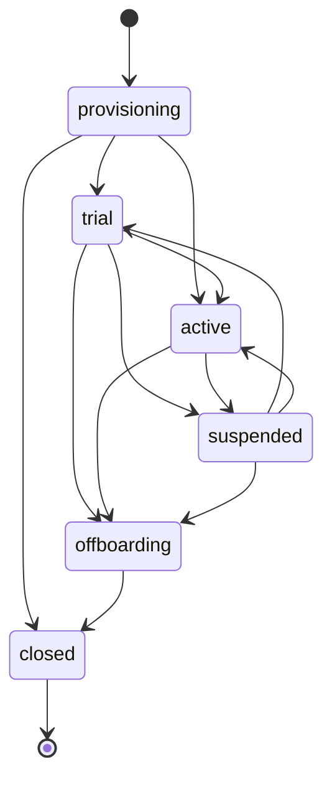

# Teknoloji Kararları ADR

Bu doküman, IK Platform için temel teknoloji kararlarını ADR formatında özetler.

## 1. ADR özeti

| ADR | Konu | Karar | Durum |
|---|---|---|---|
| ADR-001 | Backend | FastAPI + Python | Kabul |
| ADR-002 | Mimari | Modüler monolit | Kabul |
| ADR-003 | DB | PostgreSQL | Kabul |
| ADR-004 | Cache/queue | Redis | Kabul |
| ADR-005 | Web | Next.js + TypeScript | Kabul |
| ADR-006 | Mobil | Önce PWA/responsive, sonra Flutter opsiyon | Kabul |
| ADR-007 | Dosya | S3 uyumlu object storage | Kabul |
| ADR-008 | Async | Dramatiq + Redis hedef adapter; provider-neutral port/fake | Kabul |
| ADR-009 | Arama | MVP PostgreSQL FTS, V1 OpenSearch opsiyon | Kabul |
| ADR-010 | AI | AI Gateway + provider soyutlama | Kabul |
| ADR-011 | Deploy | Docker, ileride Kubernetes/Helm | Kabul |
| ADR-012 | Auth | Kendi auth + SSO entegrasyonu | Kabul |
| ADR-013 | Transaction/hata sınırı | Application command + Unit of Work, merkezi typed API mapping | Kabul |
| ADR-014 | Tenant ilişkisel bütünlüğü | Composite tenant foreign key + expand-contract | Kabul |
| ADR-015 | Concurrency/idempotency/arşiv | PostgreSQL receipt, tenant-scoped row lock, çalışan arşivi | Kabul |
| ADR-016 | Phase-0 sorgu performansı | Ölçümlü keyset, PostgreSQL trigram/normalize indexleri, aggregate consolidation; cache yok | Kabul |
| ADR-017 | Tenant lifecycle ve provisioning yüzeyi | Typed tenant/settings modeli, injected principal ile default-deny platform/tenant API, lifecycle-derived health | Kabul |

## 2. ADR-001 Backend: FastAPI

Bağlam:

- API-first ürün.
- OpenAPI üretimi önemli.
- Entegrasyon, AI ve import/export yoğun.
- Python ekosistemi veri/AI tarafında güçlü.

Karar:

- FastAPI + Pydantic + SQLAlchemy/Alembic.

Sonuç:

- Auth, audit ve tenant guard gibi çapraz kesen işler bilinçli tasarlanmalıdır.
- Kod kalitesi için typed model ve test disiplini gerekir.

## 3. ADR-002 Modüler monolit

Karar:

- MVP/V1 için mikroservis değil, modüler monolit.
- Canonical sınırlar cross-cutting yetenekler için `app.platform`, ürün sahipliği için
  `app.modules.<module>` paketleridir.
- Geçiş artımlıdır: legacy paket yalnız canonical hedefi import/re-export edebilir; canonical paket
  legacy pakete geri bağımlı olamaz.
- Katman ve modül yönleri AST tabanlı import-boundary testiyle, bütün `app` import grafiği de cycle
  testiyle korunur. Yeni üçüncü taraf architecture dependency'si eklenmez.

Gerekçe:

- Küçük/orta ekip için operasyonel sadelik.
- Modüller arası transaction ihtiyacı.
- Ürün-pazar doğrulaması öncesi servis karmaşası gereksiz.

Sonuç:

- Presentation application'a; application domain/portlara; infrastructure application portlarına
  doğru bağımlanır. Domain FastAPI, Pydantic, SQLAlchemy, settings veya provider client import etmez.
- Platform ürün modülüne; bir ürün modülü başka modülün infrastructure/ORM katmanına bağımlanmaz ve
  başka modülün tablosuna doğrudan yazmaz.
- Mevcut flat `api/core/db/models/schemas/services` paketleri tek seferde taşınmaz. Compatibility
  importları public class/function identity'sini ve mevcut API davranışını korur.
- Generic repository, speculative DDD katmanı veya mikroservis ayrıştırması bu kararın parçası
  değildir.
- Payroll, AI, reporting ve integration worker ileride ayrışma adayıdır.

## 4. ADR-003 PostgreSQL

Karar:

- Ana veritabanı PostgreSQL.
- Uygulama runtime engine ve sessionmaker'ı FastAPI lifespan başlangıcında oluşturulur;
  sahiplik uygulamadadır ve engine kapanışta dispose edilir.
- Pool ve timeout değerleri ortam konfigürasyonudur:
  `IK_DATABASE_POOL_SIZE`, `IK_DATABASE_MAX_OVERFLOW`,
  `IK_DATABASE_POOL_TIMEOUT_SECONDS`, `IK_DATABASE_POOL_RECYCLE_SECONDS`,
  `IK_DATABASE_CONNECT_TIMEOUT_SECONDS`, `IK_DATABASE_STATEMENT_TIMEOUT_MS` ve
  `IK_DATABASE_IDLE_TRANSACTION_TIMEOUT_MS`.
- PostgreSQL 16 için server-side sınırlar `statement_timeout` ve
  `idle_in_transaction_session_timeout` ile uygulanır.
- Yayınlanmış migration kimliklerini değiştirmeden korumak için PostgreSQL Alembic
  `version_num` kolonu 128 karakterdir; 0006 migration'ı mevcut 32 karakterlik kolonları
  upgrade sırasında genişletir.
- Hızlı test hattı SQLite kullanır; persistence, migration ve PostgreSQL'e özgü iddialar
  gerçek PostgreSQL entegrasyon hattında kanıtlanır.
- PostgreSQL testleri birbirinin retained verisine veya collection sırasına bağımlı olmamalıdır;
  her `postgres` testi admin DSN üzerinden kendi disposable veritabanını oluşturur ve sonunda
  düşürür.
- Mevcut `users.email` unique sözleşmesi case-sensitive'dir. Auth uygulanmadan önce
  `lower(btrim(email))` ile uygulama ve DB'nin aynı canonical değeri kullandığı explicit normalize
  kolon/index migration'ı yapılacaktır; implicit karşılaştırma semantiği veren `citext` seçilmedi.

Gerekçe:

- Transaction güvenilirliği.
- RLS desteği.
- JSONB.
- FTS/trigram.
- Geniş ekosistem.
- pgvector opsiyonu.

Sonuç:

- Tenant izolasyonu DB seviyesinde de desteklenebilir.
- Büyük rapor ve analytics için ileride read replica/warehouse gerekebilir.
- Gizli/global cache'lenmiş engine yerine uygulama kapsamında açık sahiplik vardır; test ve
  shutdown akışları bağlantıları deterministik olarak kapatabilir.
- SQLite test engine'lerine PostgreSQL/QueuePool'a özgü parametreler uygulanmaz.
- Bu karar API/OpenAPI, auth, RBAC veya RLS davranışını değiştirmez.

## 5. ADR-004 Redis

Kullanım alanları:

- Cache.
- Rate limit.
- Session/denylist yardımcı verisi.
- Queue broker.

Karar:

- Redis kalıcı ana veri deposu değildir; kaybı tolere edilmeyen veri PostgreSQL'de kalır.
- Kritik HTTP komutlarının durable idempotency receipt ve response snapshot kayıtları ADR-015
  uyarınca PostgreSQL'de tutulur; Redis bu sözleşmenin kayıt sistemi değildir.

## 6. ADR-005 Next.js + TypeScript

Gerekçe:

- Admin panel, çalışan portalı, aday portalı ve kariyer sitesi tek teknolojiyle üretilebilir.
- SSR/SEO kariyer sitesi için avantaj sağlar.
- React ekosistemi güçlüdür.

Sonuç:

- TypeScript zorunlu olmalıdır.
- UI bileşenleri tasarım sistemiyle standardize edilmelidir.

## 7. ADR-006 Mobil strateji

Karar:

- MVP'de responsive web/PWA.
- Native mobil ihtiyaç doğrulanırsa Flutter.

Gerekçe:

- MVP kapsamını şişirmemek.
- Çalışan/yönetici kritik akışlarını önce PWA ile test etmek.
- Mavi yaka yoğun pilotlarda native ihtiyaç ayrıca ölçülür.

## 8. ADR-007 S3 uyumlu depolama

Kullanım:

- Özlük belgeleri.
- Bordro PDF.
- Export dosyaları.
- Import kaynak dosyaları.

Karar:

- Dosya DB içinde BLOB olarak tutulmaz.
- Metadata DB'de, içerik object storage'da tutulur.

## 9. ADR-008 Async worker

Bağlam:

- Worker provider kurulmadan önce Python 3.13, Redis, retry/timeout/dead-letter, tenant concurrency,
  async uyumu, gözlemlenebilirlik ve operasyonel sadelik birlikte değerlendirilmelidir.
- Bu karar provider'ı domain/application koduna sızdırmamalı ve Faz 0'da broker/deploy kurmamalıdır.

2026-07-10 spike özeti:

| Aday | Güçlü taraf | Bu proje için sınır |
|---|---|---|
| Dramatiq 2.2 | Python `>=3.10`, Redis broker, AsyncIO middleware, retry/backoff, time limit, dead-letter, Prometheus ve Redis concurrent rate limiter | Tenant limiti adapter/middleware anahtarında açıkça `tenant_id` ile kurulmalı; time limit bloklayan system call'u zorla kesme garantisi değildir |
| RQ 2.10 | Python 3.13 classifier, Redis/Valkey, düşük öğrenme/operasyon yükü, retry ve failed registry | Sync/fork ağırlıklı çalışma mevcut async SQLAlchemy akışına daha fazla köprü kodu getirir |
| Celery 5.6 | En olgun routing/retry/time-limit/event ekosistemi ve Redis desteği | MVP için daha geniş config/operasyon yüzeyi; coroutine adaptasyonu daha törensel |
| Taskiq 0.12 | Async-first, FastAPI uyumu, retry/timeout/Prometheus middleware | Core paket halen alpha classifier taşır ve Redis broker ayrı paket yaşam döngüsündedir |

Karar:

- MVP provider hedefi **Dramatiq 2.2 + Redis**'tir. Provider dependency'si, Redis broker config'i,
  worker process'i ve deploy tanımı Faz 0'da eklenmez; ilk gerçek adapter ihtiyaç duyulan vertical
  phase'de aynı ADR'nin operasyon kontrolleriyle uygulanır.
- Application kodu yalnız dar `JobQueue.enqueue(JobSpec)` portuna bağımlıdır. `JobSpec`, non-zero
  `tenant_id`, `idempotency_key`, finite JSON payload, pozitif timeout ve bounded-attempt niyetini
  zorunlu kılar. Queue provider idempotency'nin kayıt sistemi değildir; business/outbox kuralı
  ayrıca authoritative olmalıdır.
- `RecordingJobQueue` deterministik test fake'idir. Üretim davranışı veya in-process worker gibi
  sunulmaz.
- Import/export, bildirim ve rapor işleri background worker ile çalışacaktır. Bordro ve AI ürün
  işleri MVP dışıdır; portta var olmaları veya Faz 0'da task tanımlanmaları gerekmez.

Gerekçe:

- Uzun işlem HTTP request içinde tutulmaz.
- Retry, timeout, terminal failure/dead-letter, tenant concurrency ve izlenebilir status gerekir.
- Dramatiq bu kontrollere Redis ile hazır primitive'ler verirken Celery'den daha küçük operasyon
  yüzeyi ve RQ'dan daha doğrudan async actor yolu sunar.

Kanıt kaynakları:

- [Dramatiq 2.2 user guide](https://dramatiq.io/guide.html)
- [Dramatiq API reference](https://dramatiq.io/reference.html)
- [RQ 2.10 package metadata](https://pypi.org/project/rq/)
- [Celery package metadata](https://pypi.org/project/celery/)
- [Taskiq package metadata](https://pypi.org/project/taskiq/)

Sonuç:

- `app.platform.workers` provider-neutral contract ve fake içerir; runtime provider kurulumu yoktur.
- Her gerçek adapter, tenant concurrency key'ini `tenant_id`'den üretmeli, retry/timeout/DLQ
  mapping'ini contract testleriyle kanıtlamalı ve payload'da secret/PII taşımamalıdır.

## 10. ADR-009 Arama

Karar:

- MVP: PostgreSQL FTS/trigram.
- Employee dizini için case-insensitive literal substring sözleşmesi PostgreSQL `ILIKE` ve
  `pg_trgm` GIN indexleriyle uygulanır; isimler ve hassas alanlar bu arama kapsamına eklenmez.
- V1/V2: OpenSearch veya benzeri arama sistemi opsiyon.

Gerekçe:

- MVP'de ikinci sistem yükü azaltılır.
- ATS/CV ve doküman araması büyüyünce ayrı search gerekir.
- Kısa/düşük seçicilikli terimlerde PostgreSQL'in ölçerek sequential scan seçmesi hata sayılmaz;
  breaking minimum arama uzunluğu ayrıca ürün sözleşmesi olmadan eklenmez.

## 11. ADR-010 AI Gateway

Karar:

- Uygulama modülleri AI provider'a doğrudan çağrı atmaz.
- Tüm AI çağrıları AI Gateway veya merkezi AI modülünden geçer.

Neden:

- PII masking.
- Prompt versioning.
- Model/provider soyutlama.
- Cost/kota takibi.
- Audit.
- RAG ACL kontrolü.

## 12. ADR-011 Deploy stratejisi

MVP:

- Docker tabanlı deployment.
- CI/CD ile test ve lint.

V1/Enterprise:

- Kubernetes + Helm opsiyonu.
- Ayrı worker deployment'ları.
- Ortam bazlı config.

## 13. ADR-012 Auth stratejisi

Karar:

- Kendi auth/session/permission modeli.
- Enterprise'da SAML/OIDC/SCIM entegrasyonu.

Gerekçe:

- Field-level permission ve HR scope modeli hazır auth ürünlerinde tam karşılanmaz.
- Uygulama içi RBAC/ABAC zaten gerekli.

## 14. ADR-013 Application command transaction ve hata sınırı

Bağlam:

- Employee ve leave business servislerinin kendi `commit()` çağrıları, domain değişikliği
  ile ileride eklenecek audit/outbox kayıtlarını tek transaction'da birleştirmeyi engelliyordu.
- Route bazında tekrarlanan exception dönüşümleri DB integrity/concurrency hataları için
  kararlı ve merkezi bir API sözleşmesi sağlamıyordu.

Karar:

- Transitional `EmployeeCommandHandler` ve `LeaveRequestCommandHandler` write akışlarını
  orkestre eder; `SqlAlchemyUnitOfWork.execute` bu akışların tek transaction sahibidir.
- `EmployeeService` ve `LeaveRequestService` gerekli yerde `flush()` eder, hiçbir migrated command
  path'inde `commit()` etmez. Commit veya hata halinde rollback UoW sınırındadır.
- Lokal demo seed servisi de yalnız flush eder. Standalone `scripts/seed_demo_data.py` komutu
  `session_factory.begin()` ile seed'in tek commit/rollback sınırını dışarıdan sahiplenir.
- Read path'leri request-scoped `AsyncSession` ve optimize, SQLAlchemy-aware query/service kodunu
  doğrudan kullanır; read için UoW zorunlu değildir.
- Beklenen domain/application hataları HTTP bilgisi taşımayan `ApplicationError` tipleridir.
  API edge'deki merkezi mapper mevcut employee/leave code, status ve public mesajlarını korur.
- `uq_employees_tenant_employee_number` ihlali pre-check yarışında da mevcut
  `409 employee_number_conflict` sözleşmesine döner. Diğer bilinmeyen integrity hataları DB
  detayı sızdırmadan `409 data_integrity_conflict`; SQLAlchemy `StaleDataError` ve tanınan DB
  concurrency hataları `409 concurrent_write_conflict` döner.
- UoW yalnız transaction capability'sidir; SQLAlchemy API'sini yansıtan generic repository,
  modüller-arası veri erişim katmanı veya god object eklenmez.

Sonuç:

- Employee ve leave servislerinin flush ettiği değişikliklerin daha sonraki komut hatasında
  rollback olduğu fresh-session persistence testleriyle doğrulanabilir; ileride audit/outbox
  aynı session ve transaction'a eklenebilir.
- Bu karar schema/model değişikliği yapmaz ve Alembic migration gerektirmez.
- P0C tek transaction ve hata sınırını kurmuştur. Leave decision winner, idempotency ve çalışan
  arşivleme davranışı daha sonra P0E kapsamında ADR-015 ile bu sınır üzerinde uygulanmıştır.
- P0C tenant-owned composite foreign key katmanını değiştirmemiştir; bu katman daha sonra P0D'de
  ADR-014 ile uygulanmış ve mevcut tenant-scoped servis kontrolleri korunmuştur.
- AST architecture testi `app/services` altında `commit()` veya `rollback()` çağrısını reddeder;
  transaction completion yalnız açık application/script sınırında kalır.

## 15. ADR-014 Tenant ilişkisel bütünlüğü

Bağlam:

- Tenant-owned child tablolar `tenant_id` taşısa da yalnız global parent `id` kolonuna bağlanan
  scalar foreign key'ler doğrudan DB write, import veya bakım yolu üzerinden cross-tenant ilişki
  kurulmasına izin veriyordu.
- Uygulama guard'ı bu veri modelinin tek koruması olmamalıdır. RLS ise Faz 1 kapsamındadır ve ilişki
  bütünlüğü constraint'inin alternatifi değildir.

Karar:

- Başka tenant-owned tablolar tarafından referans verilen parent'ta `(tenant_id, id)` candidate
  key; child'da `(tenant_id, foreign_id)` composite foreign key zorunludur.
- Mevcut şemada `employees` ve `users` candidate key taşır. `leave_requests` employee/requester/
  decider ilişkileri ile `leave_balance_summaries` employee ilişkisi composite'tir. Requester ve
  decider nullability davranışı korunur; employee history ilişkilerinin silme politikası P0E ile
  ADR-015'teki `RESTRICT` kuralına geçirilmiştir.
- Geçiş iki revision expand-contract'tır: preflight + concurrent candidate index + `NOT VALID`
  composite foreign key; ardından validation + eski scalar foreign key removal. Downgrade önce eski
  constraint'i geri getirip validate eder.
- Root `tenant_id → tenants.id` foreign key'leri ve uygulama tenant guard'ları korunur. RLS Faz 1'e
  ertelenmiştir.
- SQLite yalnız hızlı metadata/migration uyumu sağlar. PostgreSQL concurrent index, validation ve
  doğrudan write iddiaları gerçek PostgreSQL 16 testleriyle kanıtlanır.

Sonuç:

- API servisi bypass edilse bile cross-tenant leave employee/user bağlantıları persist edilemez.
- Preflight bozuk mevcut veride constraint DDL'den önce fail olur; valid veri upgrade/downgrade
  boyunca korunur.
- Yeni tenant-owned ilişki tasarımında tenant kimliği foreign key'in ayrılmaz parçasıdır.
- Endpoint/OpenAPI, auth/RBAC ve ürün davranışı değişmez.

## 16. ADR-015 Concurrency, idempotency ve çalışan arşivi

Bağlam:

- Employee number availability pre-check'i tek başına eşzamanlı insert yarışını kapatmıyordu.
- İki bağımsız leave decision transaction'ı aynı `pending` kaydı okuyup çelişkili karar
  yazabiliyordu.
- Retry edilen kritik POST/decision komutları aynı domain kaydını birden fazla kez üretebiliyordu.
- Normal employee DELETE işlemi çalışanı ve bağlı izin/bakiye geçmişini fiziksel olarak
  silebiliyordu.

Karar:

- `uq_employees_tenant_employee_number` veritabanı constraint'i authoritative winner'dır. Named
  constraint ihlali, availability pre-check yarışında da kararlı `409 employee_number_conflict`
  sözleşmesine map edilir.
- Leave approve/reject/cancel komutları kaydı hem `tenant_id` hem resource id ile seçer ve
  PostgreSQL blocking `SELECT ... FOR UPDATE` row lock alır. İlk transaction terminal kararı
  commit eder; bekleyen transaction güncel status'u görüp mevcut
  `409 leave_request_transition_conflict` sözleşmesine düşer.
- Employee create, leave create ve leave approve/reject/cancel endpointleri opsiyonel
  `X-Idempotency-Key` kabul eder. Key namespace'i tenant genelidir: `(tenant_id, idempotency_key)`
  unique constraint'i aynı tenant içinde command'lar arasında da tek sahip seçer.
- İlk başarılı komut `command_idempotency` tablosunda command adı, canonical request fingerprint,
  resource id, tamamlanma zamanı ve response snapshot'ını domain write ile aynı Unit of Work
  transaction'ında saklar. Aynı key + aynı canonical command/target/body fingerprint'i
  snapshot'tan eşdeğer yanıtı replay eder; aynı key + farklı command, hedef resource veya body
  DB ayrıntısı sızdırmadan `409 idempotency_key_mismatch` döner. Create komutlarında ayrı
  target yoktur; leave decision fingerprint'i body yanında `leave_request_id` hedefini içerir.
- Receipt'ler için TTL/cleanup job henüz yoktur. Süreli silme davranışı ayrıca retention kararı ve
  güvenli worker uygulaması olmadan varsayılmaz.
- Normal employee DELETE compatibility route'u fiziksel delete yerine `employees.archived_at`
  yazar. Arşivli çalışan employee list/detail/update yüzeylerinden, yeni leave oluşturma ve normal
  leave-balance erişiminden gizlenir; dashboard workforce sorguları da arşivliyi saymaz. Aynı
  tenant'ta tekrarlanan DELETE no-op `204` döner.
- Employee number unique constraint'i arşivli kayıtları da kapsar; arşivleme identifier'ı yeniden
  kullanıma açmaz.
- `leave_requests` ve `leave_balance_summaries` employee composite foreign key'leri
  `ON DELETE RESTRICT` kullanır. Böylece servis atlanarak yapılan doğrudan employee hard delete,
  geçmiş varken veritabanında reddedilir ve geçmiş satırlar korunur.
- Public employee purge endpoint'i yoktur. Root `tenant_id → tenants.id` cascade yalnız kısıtlı
  operatör retention/offboarding prosedürü içindir; normal employee API'sinin silme yolu değildir.
- `0011` downgrade, archive marker veya idempotency receipt varken sessiz veri/semantik kaybına
  izin vermez; operatör export/remediation yapana kadar retention preflight ile durur.

Sonuç:

- Concurrent duplicate employee create için tam bir winner, concurrent leave decision için tek
  terminal sonuç ve retry edilen kritik komut için tek resource/receipt PostgreSQL testleriyle
  doğrulanır.
- Arşivli çalışan normal API yüzeyinde silinmiş gibi görünürken employee, leave request ve leave
  balance kayıtları retention amacıyla veritabanında kalır.
- Key'ler tenant'lar arasında çakışmaz; row lock ve archive sorguları tenant predicate'ini
  korur. Bu karar auth/RBAC veya RLS yerine geçmez.

## 17. ADR-016 Phase-0 pagination ve query-performance baseline

Bağlam:

- Employee ve leave listeleri yalnız offset kullanıyor, derin sayfalarda maliyet büyüyordu.
- Employee `q` sorgusu ordinary B-tree indexlerinin kullanamadığı case-normalized contains
  predicate'leri üretiyordu; department normalizasyonu da her satırda hesaplanıyordu.
- Dashboard varsayılan yanıtta dört ayrı count dahil toplam yedi sıralı SQL statement çalıştırıyordu.
- Mevcut plain-array response sözleşmesini Faz 1 `{data, meta}` zarfına erken geçirmek uyumluluğu
  bozardı.

Karar:

- Employee listesi `(employee_number asc, id asc)`, leave request listesi
  `(created_at desc, start_date asc, id asc)` üzerinden versioned opaque keyset cursor kullanır.
  Response body plain array kalır; devam değeri `X-Next-Cursor` header'ındadır. Bounded `offset`
  deprecated compatibility path olarak korunur; positive offset ile cursor birlikte reddedilir.
- Cursor tenant kimliği veya yetki taşımaz. Tenant filtresi her sorguda cursor'dan bağımsızdır.
- `0012_p0f_query_performance`, PostgreSQL'de `pg_trgm` extension'ını hazırlar ve arşivli olmayan
  employee number/email için partial GIN indexleri ekler. Downgrade ortak kullanılabilecek
  extension'ı düşürmez.
- Department için `lower(ltrim(rtrim(department)))` stored generated kolonu ve non-archived
  kayıtlarla sınırlı `(tenant_id, department_normalized)` B-tree indexi kullanılır. Böylece exact
  case-insensitive filtre satır başına expression çalıştırmaz ve geçmiş whitespace davranışı
  korunur.
- Leave keyset sırasını karşılayan
  `(tenant_id, created_at desc, start_date asc, id asc)` indexi eklenir.
- Dashboard active/current/new-starter sayıları ile pending-leave scalar subquery'si tek statement
  olur. Query count varsayılan akışta 7'den 4'e, activity kapalıyken 5'ten 2'ye iner.
- 10,000 employee + 5,000 leave fixture'ı `VACUUM (ANALYZE)` sonrası gerçek PostgreSQL 16'da
  `EXPLAIN (ANALYZE, BUFFERS, FORMAT JSON)` ile kontrol edilir. Index adı/row bound/query count
  ve cursor `rows removed` sınırı regression gate'tir; donanıma duyarlı elapsed time CI pass/fail
  eşiği değildir.
- Redis/cache eklenmez. Cache ancak tekrar ölçüm query/index iyileştirmelerinin yetmediğini
  gösterirse ve tenant/role/scope invalidation sözleşmesi hazırsa yeniden değerlendirilir.

Sonuç:

- Büyüyen listeler stable ordering key'lerinde offset kaymasına bağlı duplicate/skip riskini
  azaltan deterministic keyset devam yoluna sahiptir; mevcut offset kullanan istemciler çalışmaya
  devam eder. Cursor bir snapshot garantisi vermez; cursor öncesine eklenen veya ordering key'i
  değişen satırlar sonraki sayfalarda yeniden konumlanabilir.
- Selective employee search planı trigram indexlerini, deep employee/leave cursor planları ilgili
  B-tree indexlerini kullanır. Full-tenant dashboard aggregate'inde planner'ın sequential scan
  seçmesine izin verilir.
- OpenSearch, response envelope standardizasyonu, audit-derived dashboard activity ve cache
  invalidation bu Phase-0 kararının kapsamı değildir.

Kanıt ve tekrar prosedürü:

- [Phase 0 Query Performance Baseline](../09-uygulama/12-phase-0-query-performance-baseline.md)

## 18. ADR-017 Tenant lifecycle, typed settings ve platform provisioning

Bağlam:

- Faz 1'in ilk dikey kesiti tenant provisioning, metadata ve tenant ayarlarını görünür bir API
  yüzeyiyle sunmalıdır; platform operatörüne employee, leave veya başka müşteri iş verisi açmamalıdır.
- Authentication/session/RBAC Faz 2 işidir. Bu nedenle bir header veya request body'sindeki
  `tenant_id`/user ID değerini yetki kanıtı saymak, geçici bile olsa güvenli bir temel değildir.
- Serbest biçimli JSON ayarları şema dışı anahtar, tip ve doğrulama davranışını kalıcılaştırır.
  Tenant ayarlarının ilk allowlist'i ürün sözleşmesi ve ilişkisel şema ile aynı olmalıdır.
- Faz 1.2 request context ve standart `{data, meta}` zarfı henüz yoktur. Mevcut doğrudan response
  uyumluluğunu F1A içinde kırmak bu dikey kesitin kapsamını aşar.

Karar:

- F1A yalnız şu yedi operation'ı ekler:
  `POST/GET /api/v1/platform/tenants`,
  `GET/PATCH /api/v1/platform/tenants/{tenant_id}`,
  `GET /api/v1/tenant` ve
  `GET/PATCH /api/v1/tenant/settings`.
  `/api/v1/tenant/features` veya başka feature-flag endpoint'i bu kesitte yoktur.
- Platform route'ları yalnız trusted upstream adapter tarafından enjekte edilen immutable
  `PlatformPrincipal`; tenant route'ları yalnız immutable `TenantPrincipal` ile çalışır.
  Production/default dependency her iki yüzeyde de fail-closed davranır. Testler Phase 2 auth
  gelene kadar dependency override kullanabilir. Header, query, path veya body içindeki user/tenant
  ID hiçbir zaman bu principal'ları oluşturmaz veya authorization sağlamaz.
- F1A success response'ları mevcut API uyumluluğu için doğrudan typed object/list döner. Standart
  `{data, meta}` zarfı, immutable genel `RequestContext` ve correlation middleware Faz 1.2'de
  versionlanmış/duyurulmuş compatibility planıyla ele alınır.
- Canonical create/PATCH plan kodları `core`, `professional`, `enterprise`; data region değerleri
  `tr-1`, `eu-1`; locale değerleri `tr-TR`, `en-US` olarak allowlist edilir. Pre-F1A `premium`
  plan satırları list/detail/current response'larında read-only compatibility olarak tanınır,
  ancak create/PATCH `premium` kabul etmez ve migration bunları sessizce yeniden yazmaz. Timezone
  geçerli bir IANA timezone adı olmalıdır. `data_region` yalnız tenant `provisioning` durumundayken
  değiştirilebilir; sonrasında lifecycle veya plan değişikliği region relocation anlamına gelmez.
- `tenant_settings` bir arbitrary JSON blob değildir. `tenant_id` aynı zamanda primary key ve
  `tenants.id` için `ON DELETE CASCADE` foreign key'dir. Fixed kolonlar yalnız
  `week_start_day` (`monday|sunday`),
  `date_format` (`DD.MM.YYYY|MM/DD/YYYY|YYYY-MM-DD`) ve
  `time_format` (`24h|12h`) değerlerini taşır; `locale` ve `timezone` tenant'ın typed temel
  kolonlarında canonical tutulur. Tenant settings API'sinin allowlist'i tam olarak
  `locale`, `timezone`, `week_start_day`, `date_format`, `time_format` anahtarlarıdır;
  `extra="forbid"` semantiğiyle key/value ekleme kabul edilmez.
- Tenant provisioning tenant satırı ile default settings satırını tek transaction'da oluşturur.
  Mevcut tenant'lara migration sırasında sırasıyla `monday`, `DD.MM.YYYY`, `24h` defaultlarıyla
  bir settings satırı backfill edilir. `0013` downgrade custom settings'i sessizce kaybetmez:
  default dışı satır sayısını `custom_tenant_settings` olarak raporlayıp export/default restoration
  yapılana kadar fail eder; yalnız tüm satırlar default iken tablo kaldırılabilir.
- Lifecycle aynı-state idempotent no-op dahil aşağıdaki directed graph'tır. Listelenmeyen her
  transition reddedilir:

Lifecycle erişim ve platform health matrisi:

| Tenant status | F1A current/settings yüzeyi | Platform `health` | Kural |
|---|---|---|---|
| `provisioning` | `platform_only` | `provisioning` | `/tenant` ve settings erişimi kapalıdır; provisioning platformdan tamamlanır |
| `trial` | `read_write` | `healthy` | Current/settings GET ve settings PATCH açıktır |
| `active` | `read_write` | `healthy` | Current/settings GET ve settings PATCH açıktır |
| `suspended` | `read_only` | `restricted` | Current/settings GET açıktır; settings PATCH reddedilir |
| `offboarding` | `read_only` | `offboarding` | Current/settings GET açıktır; settings PATCH reddedilir; export/retention orkestrasyonu F1A dışıdır |
| `closed` | `denied` | `closed` | Current/settings erişimi reddedilir; platform lifecycle metadata'sı görülebilir |

Phase-0 employee/leave/dashboard route'larının caller-header compatibility davranışı F1A içinde
genişletilmez veya lifecycle authorization gibi sunulmaz. Bu header principal üretmez. Phase 2
authenticated request context'i devreye alırken lifecycle policy protected business route'larına
merkezi olarak compose edilir; F1A testi yalnız yeni injected-principal current/settings yüzeyini
ve pure domain policy'yi sabitler.

- Platform list/detail response'u yalnız tenant kimliği, slug/name, lifecycle, plan, region,
  locale/timezone, timestamps ve lifecycle'dan deterministik türetilen `health` metadata'sını
  taşır. Health sorgusu employee/leave tablolarını saymaz veya join etmez; HR count, record,
  payload, document, leave ya da sensitive customer data platform response'una eklenemez.

Sonuç:

- Yeni/update tenant status, plan, locale ve region inputları API/domain'de typed allowlist ile
  sınırlıdır; mevcut legacy tenant satırları yeniden yorumlanmaz. İlişkisel şemada mevcut status
  check'i korunur, yeni settings değerleri named check constraint'lerle sınırlanır; IANA timezone
  doğrulaması application boundary'sindedir.
- Settings PATCH partial update'tir fakat yalnız sabit allowlist'i kabul eder. Tenant principal'ın
  tenant scope'u dependency'den gelir ve path/body ile değiştirilemez; cross-tenant negatif test bu
  kuralı sabitler.
- `0013_tenant_settings` SQLite ve PostgreSQL için data-preserving upgrade/downgrade/upgrade
  round-trip, existing-tenant backfill ve custom-settings downgrade refusal sağlamak üzere
  tasarlanmıştır. Bu davranış ve PostgreSQL'e özgü iddialar gate tamamlanmadan kabul edilmiş
  sayılmaz; gerçek PostgreSQL lane'inde doğrulanır.
- F1A auth/session/RBAC, audit persistence/event recorder, PostgreSQL RLS, feature flags,
  legal entity, support/break-glass erişimi veya başka Phase 1.2+/ürün modülü eklemez. Bu ADR,
  Phase 2 kimlik doğrulamasının yerine geçmez; yalnız güvenli injection seam ve fail-closed
  başlangıç davranışını tanımlar.
- F1A lifecycle/settings, generated OpenAPI, SQLite ve PostgreSQL 17.10 gate'leri tamamlanmıştır.

## 19. Ertelenen kararlar

| Konu | Tetikleyici |
|---|---|
| Kafka | Günlük olay hacmi Redis/worker yapısını aşarsa |
| ClickHouse | People analytics PostgreSQL/read replica ile yetmezse |
| Temporal | Workflow karmaşıklığı approval engine'i aşarsa |
| Full native app | PWA aktivasyon/metrikleri yetersiz kalırsa |
| Private AI model | Enterprise veri yerleşimi ve güvenlik ihtiyacı doğarsa |

## 20. İlgili dokümanlar

- [Teknik Mimari Genel Bakış](01-teknik-mimari-genel-bakis.md)
- [Çok Kiracılık ve Veri İzolasyonu](02-cok-kiracilik-ve-veri-izolasyonu.md)
- [AI Özellikleri ve Governance Modülü](../03-moduller/12-ai-ozellikleri-ve-governance.md)
- [OpenAPI Endpoint Taslağı](../09-uygulama/03-openapi-endpoint-taslagi.md)
- [ERD ve Migration Uygulama Planı](../09-uygulama/04-erd-migration-uygulama-plani.md)
- [API Implementation Status](../09-uygulama/11-api-implementation-status.md)
