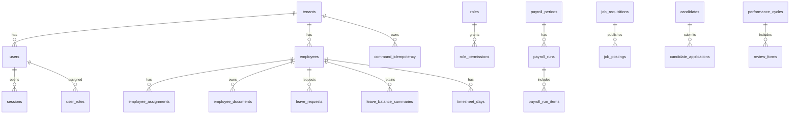

# Veritabanı Modeli ve ERD

Bu doküman, IK Platform'un ana veri modelini, domain tablolarını, tenant izolasyonu, indeksleme, partitioning ve hassas veri yaklaşımını tanımlar.

## 1. Karar özeti

Ana veri deposu PostgreSQL'dir. Tüm tenant-owned tablolarda `tenant_id` bulunur. Hassas alanlar
uygulama seviyesinde şifrelenir veya maskelenir. Tenant izolasyonu uygulama guard'ları,
tenant-owned ilişkilerde composite foreign key'ler ve Faz 1 PostgreSQL RLS ile katmanlı korunur.

## 2. Kavramsal ERD



## 3. Domain tablo grupları

| Domain | Tablolar |
|---|---|
| CORE/AUTH/RBAC | `tenants`, `tenant_settings`, `users`, `sessions`, `roles`, `permissions`, `user_roles`, `command_idempotency` |
| EMP/DOC | `employees`, `employee_profiles`, `employee_employments`, `employee_assignments`, `employee_documents`, `document_types` |
| ORG | `legal_entities`, `branches`, `departments`, `positions`, `headcount_requests` |
| LEAVE/TIME | `leave_types`, `leave_balances`, `leave_requests`, `holiday_calendars`, `shift_assignments`, `time_clock_events`, `timesheet_days` |
| PAY | `payroll_periods`, `payroll_exports`, `payslips`, `pay_components`, `legislation_parameters` |
| ATS | `job_requisitions`, `job_postings`, `candidates`, `candidate_applications`, `interviews`, `offers` |
| PERF/LMS | `goals`, `performance_cycles`, `review_forms`, `learning_courses`, `competencies`, `development_plans` |
| SS/Workflow | `requests`, `approval_tasks`, `delegations`, `announcements`, `notifications` |
| REP/AI/INT | `report_definitions`, `export_jobs`, `ai_requests`, `ai_outputs`, `integration_connectors`, `webhook_deliveries` |
| OPS | `audit_events`, `security_events`, `outbox_events`, `background_jobs` |

## 4. Temel veri kuralları

| Kural | Açıklama |
|---|---|
| `tenant_id` zorunlu | Tenant-owned tüm tablolarda bulunur |
| Tenant-owned ilişki | Parent `(tenant_id, id)` candidate key; child `(tenant_id, foreign_id)` composite foreign key taşır |
| UUID | Dışa açık ID'ler tahmin edilemez olmalıdır |
| Archive | Yasal saklama gerektiren employee verisi `archived_at` ile gizlenir; normal API hard delete yapmaz |
| Concurrency | Kritik transition kaydı tenant-scoped row lock veya uygun olduğunda optimistic `version` ile korunur |
| Audit | Kritik değişikliklerde before/after hash veya snapshot tutulur |
| Effective dating | Assignment, ücret, pozisyon gibi tarihsel veri aralıkla tutulur |
| Reference data | Mevzuat, tatil, para birimi gibi değerler versiyonlanır |

Mevcut Faz 0 şemasında `employees` ve `users` parent candidate key taşır.
`leave_requests.employee_id`, `requested_by_user_id`, `decided_by_user_id` ile
`leave_balance_summaries.employee_id` referansları child `tenant_id` kolonuyla birlikte parent'ın
`(tenant_id, id)` anahtarına bağlanır. Root ownership ilişkileri doğrudan `tenant_id → tenants.id`
olarak kalır. Bu kural yeni tenant-owned ilişki eklenirken de migration ve model metadata'sında
birlikte temsil edilmelidir.

P0E sonrasında employee yaşam döngüsü ve komut retry verisi için ek kurallar şöyledir:

- `employees.archived_at is null` normal employee görünürlüğünü ifade eder. Arşivli satır
  list/detail/update, yeni leave ve normal leave-balance erişiminden gizlenir; aynı tenant'ta
  tekrarlanan archive komutu no-op'tur.
- `(tenant_id, employee_number)` unique constraint'i arşivli satırı kapsamaya devam eder; çalışan
  numarası arşivlemeyle yeniden kullanıma açılmaz.
- `leave_requests` ve `leave_balance_summaries` employee composite foreign key'leri
  `ON DELETE RESTRICT` taşır. Arşiv geçmiş satırları silmez; doğrudan employee hard delete de child
  geçmiş varken reddedilir.
- Public employee purge yolu yoktur. Root tenant cascade yalnız kısıtlı operatör
  retention/offboarding prosedürü içindir.
- `command_idempotency` tenant-genel key namespace'inde command adı, request fingerprint, resource
  id, tamamlanma zamanı ve response snapshot saklar. Aynı key/istek replay edilir; farklı
  command/body `409 idempotency_key_mismatch` üretir. Receipt TTL/cleanup henüz uygulanmamıştır.
- Leave terminal kararları `(tenant_id, id)` ile seçilen blocking PostgreSQL row lock altında
  verilir; yalnız bir pending transition kazanır.

## 5. İndeks stratejisi

| Tablo | İndeks |
|---|---|
| `employees` | `(tenant_id, employee_number) unique`, `(tenant_id, status)`, `(tenant_id, archived_at)`, non-archived `employee_number`/`email` partial `pg_trgm` GIN, non-archived `(tenant_id, department_normalized)` |
| `command_idempotency` | `(tenant_id, idempotency_key) unique`, `(tenant_id)` |
| `employee_assignments` | `(tenant_id, employee_id, valid_from desc)`, `(tenant_id, department_id)` |
| `employee_documents` | `(tenant_id, employee_id, document_type_id)`, `(tenant_id, valid_until)` |
| `leave_requests` | `(tenant_id, employee_id, start_date)`, `(tenant_id, status, created_at desc)`, `(tenant_id, created_at desc, start_date asc, id asc)` |
| `time_clock_events` | `(tenant_id, employee_id, event_at desc)`, `(tenant_id, device_id, event_at)` |
| `payroll_exports` | `(tenant_id, period, created_at desc)` |
| `candidates` | `(tenant_id, email_hash)`, search index |
| `audit_events` | `(tenant_id, created_at desc)`, `(tenant_id, event_type, created_at desc)` |
| `outbox_events` | `(status, created_at)` |

## 6. Partitioning adayları

| Tablo | Partition | Gerekçe |
|---|---|---|
| `audit_events` | Aylık | Yüksek hacim ve retention |
| `security_events` | Aylık | Güvenlik olayı hacmi |
| `time_clock_events` | Aylık | PDKS yoğun veri |
| `notifications` | Aylık | Temizlik kolaylığı |
| `ai_requests` | Aylık | Token/audit hacmi |
| `webhook_deliveries` | Aylık | Delivery log büyümesi |

## 7. Hassas veri yaklaşımı

| Alan | Yaklaşım |
|---|---|
| TCKN/YKN/pasaport | Şifreli değer + arama gerekiyorsa hash/blind index |
| IBAN | Şifreli değer + son 4 hane |
| Maaş/ücret | Şifreli numeric payload veya ayrı secure alan |
| Sağlık/engellilik | Özel permission, şifreli belge/veri |
| Aday notları | Şifreli metin |
| AI çıktıları | Şifreli çıktı ve governance metadata |

## 8. RLS standardı

RLS uygulanırsa standart policy:

```sql
CREATE POLICY tenant_isolation
ON table_name
USING (tenant_id = current_setting('app.tenant_id')::uuid)
WITH CHECK (tenant_id = current_setting('app.tenant_id')::uuid);
```

Kurallar:

- App DB rolü `BYPASSRLS` alamaz.
- Transaction başında tenant context set edilir.
- Faz 1 RLS rollout'u başladığında policy'siz tenant tablosu CI'da fail etmelidir.

## 9. Backup ve restore

| Alan | Hedef |
|---|---|
| PITR | 35 gün hedef |
| Full backup | Günlük |
| Restore test | Aylık |
| Tenant restore | Logical export/import prosedürü |
| Backup encryption | KMS veya eşdeğer |

## 10. Kabul kriterleri

- Tenant-owned tablolar `tenant_id` taşır.
- Hassas alanlar plaintext olarak gereksiz tutulmaz.
- Critical tablolar için indeks stratejisi tanımlıdır.
- Audit/time/webhook gibi yüksek hacimli tablolar partition adayıdır.
- Cross-tenant testler veri modeliyle desteklenir.
- PostgreSQL doğrudan write negatif testleri composite foreign key constraint adını doğrular;
  SQLite sonucu PostgreSQL constraint kanıtı sayılmaz.
- Concurrent leave decision ve aynı-key idempotency winner davranışı gerçek PostgreSQL bağımsız
  session testleriyle doğrulanır.
- Normal employee archive leave/balance geçmişini korur; doğrudan hard delete history FK'leri
  nedeniyle reddedilir.

## 11. İlgili dokümanlar

- [Çok Kiracılık ve Veri İzolasyonu](../04-mimari/02-cok-kiracilik-ve-veri-izolasyonu.md)
- [CORE, AUTH ve RBAC Modülleri](../03-moduller/01-core-auth-rbac.md)
- [API Standartları, OpenAPI ve Webhook](02-api-standartlari-openapi-webhook.md)
