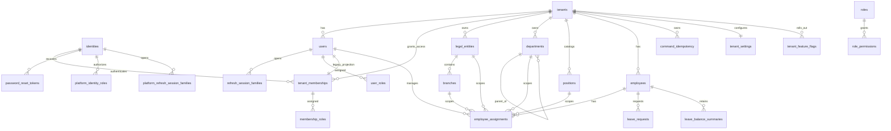

# Veritabanı Modeli ve ERD

Bu doküman, IK Platform'un ana veri modelini, domain tablolarını, tenant izolasyonu, indeksleme, partitioning ve hassas veri yaklaşımını tanımlar.

## 1. Karar özeti

Ana veri deposu PostgreSQL'dir. Tüm tenant-owned tablolarda `tenant_id` bulunur. Hassas alanlar
uygulama seviyesinde şifrelenir veya maskelenir. Tenant izolasyonu uygulama guard'ları,
tenant-owned ilişkilerde composite foreign key'ler ve F1C forced PostgreSQL RLS ile katmanlı
korunur. SQLite hızlı uyumluluk testidir; RLS kanıtı gerçek PostgreSQL lane'indedir.
Historical F1E Faz 1 kapanışında fiziksel şema `0015_f1d_feature_flags` idi. F2A–F2F
activation, server-side session, RBAC, append-only audit ve dar runtime grant'lerini `0016`–`0021`
ile ekledi. Phase 3 zinciri doğrusaldır: P3A–P3E global identity, tenant membership, e-posta-
öncelikli login, tek-kullanımlı kurum seçimi, ayrı platform auth realm'i ve recovery checkpoint'ini
`0022`–`0026` ile; P3F–P3I legal entity/branch, departman, pozisyon ve effective-dated assignment
şemasını `0027`–`0030` ile kurar. P3J lazy org chart için yeni tablo eklemez. P3K'nin
`0031_p3k_legacy_tenant_auth_boundary` revision'ı da katalog-only kapanıştır: HR director ve HR
specialist rollerine `leave:manage:tenant` grant'i ekler; Phase 4 verisi veya ürün tablosu eklemez.
Güncel tek Alembic head bu `0031` revision'ıdır.

## 2. Kavramsal ERD



Bu diyagram güncel fiziksel core/auth/organization ilişkilerini gösterir. Employee 360 alt
kayıtları, doküman, payroll, ATS, performance, LMS, PDKS ve entegrasyon tabloları sonraki faz
planıdır; güncel Phase 3 şeması varmış gibi yorumlanmamalıdır.

## 3. Domain tablo grupları

| Durum | Domain | Tablolar |
|---|---|---|
| Uygulandı | CORE/AUTH/RBAC | `tenants`, `tenant_settings`, `tenant_feature_flags`, `identities`, `tenant_memberships`, `membership_roles`, `users`, `user_activation_tokens`, `password_reset_tokens`, `organization_selection_transactions`, `organization_selection_choices`, `refresh_session_families`, `refresh_session_tokens`, `platform_identity_roles`, `platform_refresh_session_families`, `platform_refresh_session_tokens`, `authentication_rate_limit_buckets`, `roles`, `permissions`, `role_permissions`, `user_roles`, `command_idempotency` |
| Uygulandı | EMP/ORG | `employees`, `legal_entities`, `branches`, `department_hierarchy_write_fences`, `departments`, `positions`, `employee_assignments` |
| Uygulandı | LEAVE/OPS | `leave_requests`, `leave_balance_summaries`, append-only `audit_events` |
| Phase 4+ planı | Employee/DOC | `employee_profiles`, `employee_employments`, `employee_documents`, `document_types` |
| Sonraki faz planı | TIME/PAY/ATS/PERF/LMS/Workflow/REP/AI/INT | `leave_types`, `holiday_calendars`, `time_clock_events`, payroll, recruitment, performance, learning, workflow, reporting, AI ve integration tabloları |
| Sonraki faz planı | OPS | `security_events`, `outbox_events`, `background_jobs` |

## 4. Temel veri kuralları

| Kural | Açıklama |
|---|---|
| `tenant_id` zorunlu | Tenant-owned tüm tablolarda bulunur |
| Tenant-owned ilişki | Parent `(tenant_id, id)` candidate key; child `(tenant_id, foreign_id)` composite foreign key taşır |
| UUID | Dışa açık ID'ler tahmin edilemez olmalıdır |
| Archive | Yasal saklama gerektiren employee verisi `archived_at` ile gizlenir; normal API hard delete yapmaz |
| Concurrency | Kritik transition kaydı tenant-scoped row lock veya uygun olduğunda optimistic `version` ile korunur |
| Audit | Kritik değişikliklerde yalnız allowlisted changed-field/metadata tutulur; secret/credential ve full payload snapshot'ı varsayılan olarak yasaktır |
| Effective dating | Güncel Phase 3'te organization assignment aralıkla tutulur; ücret gibi sonraki faz tarihsel verileri aynı ilkeyi izler |
| Reference data | Mevzuat, tatil, para birimi gibi değerler versiyonlanır |

Mevcut Faz 0 şemasında `employees` ve `users` parent candidate key taşır.
`leave_requests.employee_id`, `requested_by_user_id`, `decided_by_user_id` ile
`leave_balance_summaries.employee_id` referansları child `tenant_id` kolonuyla birlikte parent'ın
`(tenant_id, id)` anahtarına bağlanır. Root ownership ilişkileri doğrudan `tenant_id → tenants.id`
olarak kalır. Bu kural yeni tenant-owned ilişki eklenirken de migration ve model metadata'sında
birlikte temsil edilmelidir.

P3A identity-boundary kuralları:

- Global `identities` normalized e-posta, credential-wide durum ve parola sahipliğinin canonical
  kaynağıdır; tenant ve platform runtime capability'leri bu tabloya grant almaz. P3E activation,
  tenant/platform login ve recovery bu global sınırı kullanır; legacy `users.password_hash`
  expand-contract rollback/foreign-key uyumluluğu için atomik projection olarak tutulur.
- `tenant_memberships` aynı identity'yi farklı tenant'lara bağlayabilir fakat
  `(tenant_id,identity_id)` unique olduğu için aynı tenant'ta duplicate membership kurulamaz.
  Membership ID, expand süresince legacy public `users.id` ile aynıdır; tenant-local ad, durum ve
  permission version membership'te ayrıca temsil edilir.
- `membership_roles(tenant_id,membership_id)`, membership candidate key'ine composite FK ile
  bağlanır. Böylece global identity ID tek başına tenant role authority oluşturmaz.
- `password_reset_tokens` raw credential saklamaz; SHA-256 hash, identity FK, expiry ve tek-kullanım
  terminal durumu taşır. Confirm global ve legacy hash'leri aynı UoW'da reconcile eder, tenant ve
  platform refresh family'leri ile açık organization-selection transaction'larını kapatır.
- `users`, `user_roles`, activation/session ve actor foreign key'leri expand-contract uyumluluğu
  için kaldırılmaz. Tenant login request'i yalnız e-posta/parola kabul eder; membership ve güvenli
  kurum display-name'leri ancak credential doğrulandıktan sonra bulunur. Tek membership doğrudan
  tenant session açar, birden fazlası hashli/süreli/tek-kullanımlı transaction ve opaque
  `selection_key` ile seçilir.
- Platform login `/api/v1/platform/auth/*` altında ayrı tenantless family, refresh cookie, access
  token audience ve `PlatformPrincipal` kullanır. Tenant bearer/cookie platform API'sini;
  platform bearer/cookie tenant API'sini açmaz.

P3F–P3J organization kuralları:

- Basit tenant için bir aktif default `legal_entities` kaydı backfill edilir; `branches`,
  `departments`, `positions` ve `employee_assignments` tenant-owned composite foreign key'lerle
  birbirine bağlanır.
- Departman adjacency-list hiyerarşisi, tenant-scoped write fence ile graph değişikliklerini
  serialize eder. PostgreSQL deferred cycle trigger'ı aynı statement ve concurrent write ile
  oluşturulabilecek çevrimleri DB seviyesinde reddeder.
- Pozisyon bir departman slotu değil, tenant-wide reusable iş unvanı katalogudur. Departman,
  pozisyon, şube ve manager bağı effective-dated `employee_assignments` satırında birleşir.
- Assignment aralığında `effective_to` exclusive'dir. Değişiklik açık satırı kapatıp
  `supersedes_assignment_id` ile immutable successor ekler; legacy `employees.department` ve
  `employees.position` alanları compatibility projection olarak tutulur.
- `GET /api/v1/teams/me` yalnız current assignment'taki `manager_user_id` bağından doğrudan ekibi
  türetir. `GET /api/v1/org-chart` root veya tek direct-report seviyesini bounded cursor ile lazy
  getirir; full-tenant recursive payload veya N+1 per-node lookup yoktur.

F1A tenant/config kuralları:

- Mevcut `tenants.status` DB check'i `provisioning|trial|active|suspended|offboarding|closed`
  değerlerini korur. Yeni/create update inputlarında `plan_code` yalnız
  `core|professional|enterprise`, `data_region` yalnız `tr-1|eu-1`, `locale` yalnız
  `tr-TR|en-US` kabul edilir; migration legacy plan satırlarını dönüştürmez ve bu üç kolona yeni DB
  check eklemez. Timezone geçerli IANA adı olarak application boundary'de doğrulanır.
  `data_region` yalnız provisioning durumunda değiştirilebilir.
- `tenant_settings.tenant_id` tekil tenant config kimliğidir: primary key ve `tenants.id` için
  `ON DELETE CASCADE` foreign key. Kolonlar yalnız `week_start_day`, `date_format`, `time_format`
  ve timestamps'tir; arbitrary JSON/settings/features blob'u yoktur.
- API settings görünümü tenant üzerindeki `locale` ve `timezone` ile fixed settings satırındaki
  `week_start_day`, `date_format`, `time_format` alanlarını birleştirir. Başka key kabul edilmez.
- Platform health persisted bir HR ölçümü değildir. Yalnız tenant lifecycle'dan
  `provisioning|healthy|restricted|offboarding|closed` olarak türetilir; employee/leave count veya
  payload platform sorgusuna katılmaz.

F1D'de uygulanıp F1E Faz 1 final kapısında yeniden doğrulanan rollout/configured-limit kuralları:

- `tenants.active_employee_limit` nullable ve `1..1_000_000` check'li configured platform
  metadata'dır. API alanı `limits.active_employees`'tır; employee usage/count değildir.
- `tenant_feature_flags` primary key'i `(tenant_id,key)` ve `tenant_id → tenants.id` named
  `ON DELETE CASCADE` foreign key'idir. Key check sırası `organization`, `employees`, `documents`,
  `leave`, `self_service`, `reporting`, `notifications`; `enabled` yalnız boolean'dır.
- Existing tenant backfill'inde yalnız `employees`, `leave`, `reporting` true; diğer dört key
  false'dur. Effective API response persisted değer ile katalog defaultunu karşılaştırıp
  `source=default|override` üretir; source ayrı serbest metadata kolonu değildir.
- Platform list/detail query'si `tenants` tablosundaki allowlisted kolonları explicit project eder.
  Feature query yalnız `tenant_feature_flags` ve target tenant metadata erişimini kullanır; hiçbir
  platform query employee/user/leave/document tablosuna join/count yapmaz.
- `tenant.created`, `tenant.status_changed`, `tenant.setting_changed`, `feature_flag.changed`
  eventleri F1D'de typed application contract'tır; `audit_events` persistence tablosu bu migration'a
  eklenmez.

P0E sonrasında employee yaşam döngüsü ve komut retry verisi için ek kurallar şöyledir:

- `employees.archived_at is null` normal employee görünürlüğünü ifade eder. Arşivli satır
  list/detail/update, yeni leave ve normal leave-balance erişiminden gizlenir; aynı tenant'ta
  tekrarlanan archive komutu no-op'tur.
- `(tenant_id, employee_number)` unique constraint'i arşivli satırı kapsamaya devam eder; çalışan
  numarası arşivlemeyle yeniden kullanıma açılmaz.
- `leave_requests` ve `leave_balance_summaries` employee composite foreign key'leri
  `ON DELETE RESTRICT` taşır. Arşiv geçmiş satırları silmez; doğrudan employee hard delete de child
  geçmiş varken reddedilir.
- Public employee purge yolu yoktur. Root tenant cascade yalnız kısıtlı operatör
  retention/offboarding prosedürü içindir.
- `command_idempotency` tenant-genel key namespace'inde command adı, request fingerprint, resource
  id, tamamlanma zamanı ve response snapshot saklar. Aynı key ve aynı canonical
  command/target/body fingerprint'i replay edilir; farklı command, hedef resource veya body
  `409 idempotency_key_mismatch` üretir. Leave decision fingerprint'i `leave_request_id` hedefini
  de içerir. Receipt TTL/cleanup henüz uygulanmamıştır.
- Leave terminal kararları `(tenant_id, id)` ile seçilen blocking PostgreSQL row lock altında
  verilir; yalnız bir pending transition kazanır.

## 5. İndeks stratejisi

| Tablo | İndeks |
|---|---|
| `tenants` | unique `slug`; mevcut lifecycle status check'i; yeni plan/region/locale inputları API/domain allowlist'inde |
| `tenant_settings` | primary key `tenant_id` aynı zamanda tenant foreign key |
| `tenant_feature_flags` | composite primary key `(tenant_id,key)`; fixed key/enabled check; tenant root FK; katalog sırası bounded olduğu için ayrı liste indexi yok |
| `employees` | `(tenant_id, employee_number) unique`, `(tenant_id, status)`, `(tenant_id, archived_at)`, non-archived `employee_number`/`email` partial `pg_trgm` GIN, non-archived `(tenant_id, department_normalized)` |
| `command_idempotency` | `(tenant_id, idempotency_key) unique`, `(tenant_id)` |
| `legal_entities` | tenant-unique normalized code, tek default partial unique, `(tenant_id,status,code_normalized)` |
| `branches` | tenant-unique normalized code, `(tenant_id,status,code_normalized)`, `(tenant_id,legal_entity_id,status)` |
| `departments` | tenant-unique normalized code, `(tenant_id,status,code_normalized,id)`, `(tenant_id,parent_id,status,code_normalized,id)` |
| `positions` | tenant-unique normalized code, status/code cursor B-tree'leri ve normalized code/title `pg_trgm` GIN araması |
| `employee_assignments` | tek open assignment partial unique; `(tenant_id,employee_id,effective_from,id)` history; manager scope, department ve branch effective indexleri |
| `employee_documents` (Phase 4+ planı) | `(tenant_id, employee_id, document_type_id)`, `(tenant_id, valid_until)` |
| `leave_requests` | `(tenant_id, employee_id, start_date)`, `(tenant_id, status, created_at)`, `(tenant_id, created_at desc, start_date asc, id asc)` |
| `time_clock_events` (sonraki faz planı) | `(tenant_id, employee_id, event_at desc)`, `(tenant_id, device_id, event_at)` |
| `payroll_exports` (sonraki faz planı) | `(tenant_id, period, created_at desc)` |
| `candidates` (sonraki faz planı) | `(tenant_id, email_hash)`, search index |
| `audit_events` | `(tenant_id, occurred_at, id)`, `(tenant_id, event_type, occurred_at)`, resource/actor/scope cursor indexleri |
| `outbox_events` (sonraki faz planı) | `(status, created_at)` |

## 6. Partitioning adayları

| Tablo | Partition | Gerekçe |
|---|---|---|
| `audit_events` | Aylık | Yüksek hacim ve retention |
| `security_events` | Aylık | Güvenlik olayı hacmi |
| `time_clock_events` | Aylık | PDKS yoğun veri |
| `notifications` | Aylık | Temizlik kolaylığı |
| `ai_requests` | Aylık | Token/audit hacmi |
| `webhook_deliveries` | Aylık | Delivery log büyümesi |

### 6.1 Local demo veri projection'ı

Deterministik local/dev seed iki tenant, beş tenant-local user, sekiz employee ve beş leave
request'i korur. Shared `admin@wealthyfalcon.demo` identity'si iki membership, Wealthy Falcon'da
tenant admin + HR specialist rolleri ve ayrı tenantless `super_admin` platform role projection'ı
alır. Her tenant için organization feature, tek default legal entity, bir demo branch, normalized
department/position katalogları ve employee assignment'ları persisted edilir. Assignment'lar seeded
manager user'a bağlı olduğu için team/chart demo scope'u legacy metinden değil gerçek structured
FK'lerden türetilir.

Seed existing assignment history'sini overwrite etmez ve plaintext credential yazmaz.
`scripts/seed_demo_data.py --auth-demo` yalnız local/dev + local database sınırında `wf_admin` ve
`wf_manager` için etiketli tek-kullanımlı activation URL'leri üretir.

## 7. Hassas veri yaklaşımı

Aşağıdaki alanlar Phase 4+ tasarım hedefidir; TCKN, IBAN, ücret, sağlık, aday veya AI
payload'ı güncel Phase 3 şemasında yoktur.

| Alan | Yaklaşım |
|---|---|
| TCKN/YKN/pasaport | Şifreli değer + arama gerekiyorsa hash/blind index |
| IBAN | Şifreli değer + son 4 hane |
| Maaş/ücret | Şifreli numeric payload veya ayrı secure alan |
| Sağlık/engellilik | Özel permission, şifreli belge/veri |
| Aday notları | Şifreli metin |
| AI çıktıları | Şifreli çıktı ve governance metadata |

## 8. RLS standardı

F1C ile başlayan standart, F2 ve P3 migration'larında her yeni tenant-owned tablo için
genişletilmiştir. `tenant_memberships`, membership rolleri ve tenant session tabloları;
organization-selection state'i; legal entity, branch, hierarchy fence, department, position ve
employee assignment tabloları PostgreSQL'de ilgili capability policy/grant envanteriyle birlikte
`ENABLE + FORCE RLS` korumasına alınır. `audit_events` runtime rolleri yalnız gerekli
`SELECT/INSERT` yetkilerini alır; `UPDATE/DELETE` alamaz. Standart tenant app policy:

```sql
CREATE POLICY tenant_isolation_app
ON table_name
TO wealthy_falcon_app
USING (tenant_id = nullif(current_setting('app.tenant_id', true), '')::uuid)
WITH CHECK (tenant_id = nullif(current_setting('app.tenant_id', true), '')::uuid);
```

Kurallar:

- App ve platform capability rolleri login/superuser/`BYPASSRLS` değildir.
- Transaction başında capability role ve tenant context `SET LOCAL` ile set edilir.
- Platform rolünün HR tablo read/update grant'i yoktur; tenant metadata DML ve provisioning-only
  settings/default-legal-entity INSERT'i dardır, tenant settings SELECT/UPDATE kapalıdır.
- Authentication, identity projection ve recovery capability rolleri NOLOGIN, non-superuser ve
  non-`BYPASSRLS`'dir; yalnız kendi dar tablo kolonları veya security-definer fonksiyonları için
  grant alır. Public/schema grant'leri ve beklenmeyen parent-role membership'leri catalog gate'inde
  reddedilir.
- Platform auth session tabloları tenantless'tır fakat yalnız ayrı authentication capability'sine
  açıktır. Ayrı access audience ve refresh cookie boundary'si DB grant sınırıyla birlikte test
  edilir.
- Feature tablosunda app role yalnız tenant-scoped `SELECT`, platform role yalnız
  `SELECT/INSERT/UPDATE` alır; ikisi de `DELETE` alamaz. Platform feature policy'si HR grant'i
  yaratmaz.
- Eksik/empty context sıfır satır, malformed UUID hata üretir; pool reuse tenant state taşımaz.
- Policy'siz, RLS'siz veya FORCE edilmemiş tenant tablosu PostgreSQL catalog testinde fail eder.

## 9. Backup ve restore

| Alan | Hedef |
|---|---|
| PITR | 35 gün hedef |
| Full backup | Günlük |
| Restore test | Aylık |
| Tenant restore | Logical export/import prosedürü |
| Backup encryption | KMS veya eşdeğer |

## 10. Kabul kriterleri

- Tenant-owned tablolar `tenant_id` taşır.
- Hassas alanlar plaintext olarak gereksiz tutulmaz.
- Critical tablolar için indeks stratejisi tanımlıdır.
- Audit/time/webhook gibi yüksek hacimli tablolar partition adayıdır.
- Cross-tenant testler veri modeliyle desteklenir.
- Tenant settings tablosu fixed kolonlu, tenant başına tek satırlı ve typed API allowlist'iyle
  birebir uyumludur.
- `0013` downgrade default dışı typed setting varsa sayılı preflight ile reddedilir; custom değer
  sessizce düşürülemez.
- Platform tenant metadata sorgusu HR tablosuna join/count yapmaz; health yalnız lifecycle'dır.
- Platform response'undaki `limits.active_employees` yalnız configured nullable metadata'dır;
  employee usage/count olarak üretilemez.
- Feature catalog/order/defaultlar domain, migration backfill/check ve API response ile aynıdır;
  unknown key ve cross-tenant override erişimi reddedilir.
- `tenant_feature_flags` PostgreSQL'de FORCE RLS ve exact app/platform/no-DELETE privilege matrisiyle
  korunur; SQLite sonucu bu güvenlik iddiasının kanıtı değildir.
- PostgreSQL doğrudan write negatif testleri composite foreign key constraint adını doğrular;
  SQLite sonucu PostgreSQL constraint kanıtı sayılmaz.
- Concurrent leave decision ve aynı-key idempotency winner davranışı gerçek PostgreSQL bağımsız
  session testleriyle doğrulanır.
- Normal employee archive leave/balance geçmişini korur; doğrudan hard delete history FK'leri
  nedeniyle reddedilir.
- Tenant login organization code/tenant ID kabul etmez; membership metadata'sı yalnız başarılı
  credential doğrulaması sonrası görünür. Selection replay, forged choice, cross-identity ve
  cross-tenant seçim istekleri reddedilir.
- Tenant ve platform token/cookie'leri karşı realm API'lerinde reddedilir.
- Departman cycle'ı service ve gerçek PostgreSQL concurrency/trigger katmanında imkânsızdır.
- Inactive legal entity ile archived branch/department/position yeni assignment'ta kullanılamaz;
  mevcut tarihsel assignment resolved etiketleriyle okunabilir kalır.
- Manager team scope serbest metinden değil, yalnız güncel structured assignment manager bağından
  türetilir. Org chart tek bounded seviyeyi lazy getirir.

## 11. Phase 3 / P3K final şema ve backfill kapısı

Güncel fiziksel zincir `0022_p3a_identity_memberships` ile başlayan identity expand adımlarından,
`0030_p3i_employee_assignments` organization backfill'ine ve katalog-only
`0031_p3k_legacy_tenant_auth_boundary` kapanışına kadar lineerdir. P3J ayrı migration eklemez.

- `0022` mevcut tenant user/role satırlarından global identity, membership ve membership-role
  projection'ı oluşturur; sayı/drift preflight'i eksik veya çelişkili projection'da fail eder.
- `0024` mevcut tenant refresh family'lerini membership'e bağlar; bağlanamayan family varsa
  migration devam etmez.
- `0027` mevcut her tenant için tek aktif default legal entity oluşturur.
- `0030` legacy employee department/position string'lerini tenant-local normalized department ve
  position kataloglarına map eder, default legal entity/branch ile ilk assignment aralığını kurar
  ve legacy alanları contract olarak korur. Belirsiz/bozuk state sayılı preflight ile reddedilir.
- `0031` yalnız mevcut permission/role-permission katalogunu güçlendirir; yeni domain tablosu veya
  Phase 4 alanı eklemez.

Final P3K raporu tek head'i, upgrade/backfill sayılarını, metadata drift'i, RLS/ACL catalogunu,
direct-DB tenant saldırılarını ve bounded query planlarını gerçek disposable PostgreSQL lane'inde
kaydeder. SQLite hızlı migration uyumluluk hattıdır; PostgreSQL RLS, grant, trigger, concurrent
cycle veya query-plan iddiasını kanıtlamaz. Capability rolleri cluster-global olduğu için yönetim
DSN'i shared uygulama cluster'ına değil disposable test cluster'ına ait olmalıdır.

## 12. İlgili dokümanlar

- [Çok Kiracılık ve Veri İzolasyonu](../04-mimari/02-cok-kiracilik-ve-veri-izolasyonu.md)
- [CORE, AUTH ve RBAC Modülleri](../03-moduller/01-core-auth-rbac.md)
- [API Standartları, OpenAPI ve Webhook](02-api-standartlari-openapi-webhook.md)
