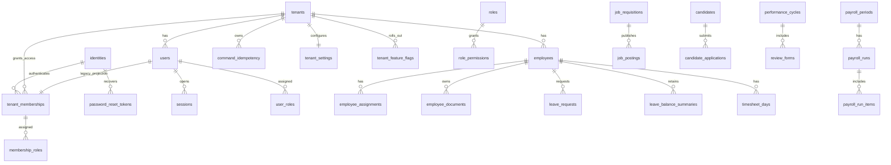

# Veritabanı Modeli ve ERD

Bu doküman, IK Platform'un ana veri modelini, domain tablolarını, tenant izolasyonu, indeksleme, partitioning ve hassas veri yaklaşımını tanımlar.

## 1. Karar özeti

Ana veri deposu PostgreSQL'dir. Tüm tenant-owned tablolarda `tenant_id` bulunur. Hassas alanlar
uygulama seviyesinde şifrelenir veya maskelenir. Tenant izolasyonu uygulama guard'ları,
tenant-owned ilişkilerde composite foreign key'ler ve F1C forced PostgreSQL RLS ile katmanlı
korunur. SQLite hızlı uyumluluk testidir; RLS kanıtı gerçek PostgreSQL lane'indedir.
Historical F1E Faz 1 kapanışında fiziksel şema `0015_f1d_feature_flags` idi. F2A–F2E activation,
server-side session, RBAC ve append-only audit tablolarını `0016`–`0020` ile ekledi. F2F'nin
PostgreSQL-only `0021_f2f_user_insert_grant` revision'ı tablo/kolon eklemeden invited-user INSERT'i
için yalnız `users.permission_version` kolon grant'ini tamamlar. P3A `0022`, legacy user sınırını
koruyan additive `identities`, `tenant_memberships` ve `membership_roles` projection'ını ekler.
P3B–P3D global tenant/platform auth sınırlarını kurar; P3E `0026_p3e_identity_checkpoint` ile
`password_reset_tokens`, existing-identity membership kabulü ve credential/session reconciliation
ekler. Güncel tek head `0026_p3e_identity_checkpoint`'tır.

## 2. Kavramsal ERD



## 3. Domain tablo grupları

| Domain | Tablolar |
|---|---|
| CORE/AUTH/RBAC | P3E checkpoint: `identities`, `tenant_memberships`, `membership_roles`, `password_reset_tokens`, `organization_selection_transactions`, `organization_selection_choices`, `platform_identity_roles`, `platform_refresh_session_families`, `platform_refresh_session_tokens`; compatibility retained: `tenants`, `tenant_settings`, `tenant_feature_flags`, `users`, `user_activation_tokens`, `refresh_session_families`, `refresh_session_tokens`, `roles`, `permissions`, `role_permissions`, `user_roles`, `command_idempotency` |
| EMP/DOC | `employees`, `employee_profiles`, `employee_employments`, `employee_assignments`, `employee_documents`, `document_types` |
| ORG | `legal_entities`, `branches`, `departments`, `positions`, `headcount_requests` |
| LEAVE/TIME | `leave_types`, `leave_balances`, `leave_requests`, `holiday_calendars`, `shift_assignments`, `time_clock_events`, `timesheet_days` |
| PAY | `payroll_periods`, `payroll_exports`, `payslips`, `pay_components`, `legislation_parameters` |
| ATS | `job_requisitions`, `job_postings`, `candidates`, `candidate_applications`, `interviews`, `offers` |
| PERF/LMS | `goals`, `performance_cycles`, `review_forms`, `learning_courses`, `competencies`, `development_plans` |
| SS/Workflow | `requests`, `approval_tasks`, `delegations`, `announcements`, `notifications` |
| REP/AI/INT | `report_definitions`, `export_jobs`, `ai_requests`, `ai_outputs`, `integration_connectors`, `webhook_deliveries` |
| OPS | F2F implemented: `audit_events`; planned later: `security_events`, `outbox_events`, `background_jobs` |

## 4. Temel veri kuralları

| Kural | Açıklama |
|---|---|
| `tenant_id` zorunlu | Tenant-owned tüm tablolarda bulunur |
| Tenant-owned ilişki | Parent `(tenant_id, id)` candidate key; child `(tenant_id, foreign_id)` composite foreign key taşır |
| UUID | Dışa açık ID'ler tahmin edilemez olmalıdır |
| Archive | Yasal saklama gerektiren employee verisi `archived_at` ile gizlenir; normal API hard delete yapmaz |
| Concurrency | Kritik transition kaydı tenant-scoped row lock veya uygun olduğunda optimistic `version` ile korunur |
| Audit | Kritik değişikliklerde yalnız allowlisted changed-field/metadata tutulur; secret/credential ve full payload snapshot'ı varsayılan olarak yasaktır |
| Effective dating | Assignment, ücret, pozisyon gibi tarihsel veri aralıkla tutulur |
| Reference data | Mevzuat, tatil, para birimi gibi değerler versiyonlanır |

Mevcut Faz 0 şemasında `employees` ve `users` parent candidate key taşır.
`leave_requests.employee_id`, `requested_by_user_id`, `decided_by_user_id` ile
`leave_balance_summaries.employee_id` referansları child `tenant_id` kolonuyla birlikte parent'ın
`(tenant_id, id)` anahtarına bağlanır. Root ownership ilişkileri doğrudan `tenant_id → tenants.id`
olarak kalır. Bu kural yeni tenant-owned ilişki eklenirken de migration ve model metadata'sında
birlikte temsil edilmelidir.

P3A identity-boundary kuralları:

- Global `identities` normalized e-posta, credential-wide durum ve parola sahipliğinin canonical
  kaynağıdır; tenant ve platform runtime capability'leri bu tabloya grant almaz. P3E activation,
  tenant/platform login ve recovery bu global sınırı kullanır; legacy `users.password_hash`
  expand-contract rollback/foreign-key uyumluluğu için atomik projection olarak tutulur.
- `tenant_memberships` aynı identity'yi farklı tenant'lara bağlayabilir fakat
  `(tenant_id,identity_id)` unique olduğu için aynı tenant'ta duplicate membership kurulamaz.
  Membership ID, expand süresince legacy public `users.id` ile aynıdır; tenant-local ad, durum ve
  permission version membership'te ayrıca temsil edilir.
- `membership_roles(tenant_id,membership_id)`, membership candidate key'ine composite FK ile
  bağlanır. Böylece global identity ID tek başına tenant role authority oluşturmaz.
- `password_reset_tokens` raw credential saklamaz; SHA-256 hash, identity FK, expiry ve tek-kullanım
  terminal durumu taşır. Confirm global ve legacy hash'leri aynı UoW'da reconcile eder, tenant ve
  platform refresh family'leri ile açık organization-selection transaction'larını kapatır.
- `users`, `user_roles`, activation/session ve actor foreign key'leri P3E expand aşamasında
  kaldırılmaz. P3A–P3E identity checkpoint'i tamamlanmıştır; organization tabloları P3F işidir.

F1A tenant/config kuralları:

- Mevcut `tenants.status` DB check'i `provisioning|trial|active|suspended|offboarding|closed`
  değerlerini korur. Yeni/create update inputlarında `plan_code` yalnız
  `core|professional|enterprise`, `data_region` yalnız `tr-1|eu-1`, `locale` yalnız
  `tr-TR|en-US` kabul edilir; migration legacy plan satırlarını dönüştürmez ve bu üç kolona yeni DB
  check eklemez. Timezone geçerli IANA adı olarak application boundary'de doğrulanır.
  `data_region` yalnız provisioning durumunda değiştirilebilir.
- `tenant_settings.tenant_id` tekil tenant config kimliğidir: primary key ve `tenants.id` için
  `ON DELETE CASCADE` foreign key. Kolonlar yalnız `week_start_day`, `date_format`, `time_format`
  ve timestamps'tir; arbitrary JSON/settings/features blob'u yoktur.
- API settings görünümü tenant üzerindeki `locale` ve `timezone` ile fixed settings satırındaki
  `week_start_day`, `date_format`, `time_format` alanlarını birleştirir. Başka key kabul edilmez.
- Platform health persisted bir HR ölçümü değildir. Yalnız tenant lifecycle'dan
  `provisioning|healthy|restricted|offboarding|closed` olarak türetilir; employee/leave count veya
  payload platform sorgusuna katılmaz.

F1D'de uygulanıp F1E Faz 1 final kapısında yeniden doğrulanan rollout/configured-limit kuralları:

- `tenants.active_employee_limit` nullable ve `1..1_000_000` check'li configured platform
  metadata'dır. API alanı `limits.active_employees`'tır; employee usage/count değildir.
- `tenant_feature_flags` primary key'i `(tenant_id,key)` ve `tenant_id → tenants.id` named
  `ON DELETE CASCADE` foreign key'idir. Key check sırası `organization`, `employees`, `documents`,
  `leave`, `self_service`, `reporting`, `notifications`; `enabled` yalnız boolean'dır.
- Existing tenant backfill'inde yalnız `employees`, `leave`, `reporting` true; diğer dört key
  false'dur. Effective API response persisted değer ile katalog defaultunu karşılaştırıp
  `source=default|override` üretir; source ayrı serbest metadata kolonu değildir.
- Platform list/detail query'si `tenants` tablosundaki allowlisted kolonları explicit project eder.
  Feature query yalnız `tenant_feature_flags` ve target tenant metadata erişimini kullanır; hiçbir
  platform query employee/user/leave/document tablosuna join/count yapmaz.
- `tenant.created`, `tenant.status_changed`, `tenant.setting_changed`, `feature_flag.changed`
  eventleri F1D'de typed application contract'tır; `audit_events` persistence tablosu bu migration'a
  eklenmez.

P0E sonrasında employee yaşam döngüsü ve komut retry verisi için ek kurallar şöyledir:

- `employees.archived_at is null` normal employee görünürlüğünü ifade eder. Arşivli satır
  list/detail/update, yeni leave ve normal leave-balance erişiminden gizlenir; aynı tenant'ta
  tekrarlanan archive komutu no-op'tur.
- `(tenant_id, employee_number)` unique constraint'i arşivli satırı kapsamaya devam eder; çalışan
  numarası arşivlemeyle yeniden kullanıma açılmaz.
- `leave_requests` ve `leave_balance_summaries` employee composite foreign key'leri
  `ON DELETE RESTRICT` taşır. Arşiv geçmiş satırları silmez; doğrudan employee hard delete de child
  geçmiş varken reddedilir.
- Public employee purge yolu yoktur. Root tenant cascade yalnız kısıtlı operatör
  retention/offboarding prosedürü içindir.
- `command_idempotency` tenant-genel key namespace'inde command adı, request fingerprint, resource
  id, tamamlanma zamanı ve response snapshot saklar. Aynı key ve aynı canonical
  command/target/body fingerprint'i replay edilir; farklı command, hedef resource veya body
  `409 idempotency_key_mismatch` üretir. Leave decision fingerprint'i `leave_request_id` hedefini
  de içerir. Receipt TTL/cleanup henüz uygulanmamıştır.
- Leave terminal kararları `(tenant_id, id)` ile seçilen blocking PostgreSQL row lock altında
  verilir; yalnız bir pending transition kazanır.

## 5. İndeks stratejisi

| Tablo | İndeks |
|---|---|
| `tenants` | unique `slug`; mevcut lifecycle status check'i; yeni plan/region/locale inputları API/domain allowlist'inde |
| `tenant_settings` | primary key `tenant_id` aynı zamanda tenant foreign key |
| `tenant_feature_flags` | composite primary key `(tenant_id,key)`; fixed key/enabled check; tenant root FK; katalog sırası bounded olduğu için ayrı liste indexi yok |
| `employees` | `(tenant_id, employee_number) unique`, `(tenant_id, status)`, `(tenant_id, archived_at)`, non-archived `employee_number`/`email` partial `pg_trgm` GIN, non-archived `(tenant_id, department_normalized)` |
| `command_idempotency` | `(tenant_id, idempotency_key) unique`, `(tenant_id)` |
| `employee_assignments` | `(tenant_id, employee_id, valid_from desc)`, `(tenant_id, department_id)` |
| `employee_documents` | `(tenant_id, employee_id, document_type_id)`, `(tenant_id, valid_until)` |
| `leave_requests` | `(tenant_id, employee_id, start_date)`, `(tenant_id, status, created_at)`, `(tenant_id, created_at desc, start_date asc, id asc)` |
| `time_clock_events` | `(tenant_id, employee_id, event_at desc)`, `(tenant_id, device_id, event_at)` |
| `payroll_exports` | `(tenant_id, period, created_at desc)` |
| `candidates` | `(tenant_id, email_hash)`, search index |
| `audit_events` | `(tenant_id, created_at desc)`, `(tenant_id, event_type, created_at desc)` |
| `outbox_events` | `(status, created_at)` |

## 6. Partitioning adayları

| Tablo | Partition | Gerekçe |
|---|---|---|
| `audit_events` | Aylık | Yüksek hacim ve retention |
| `security_events` | Aylık | Güvenlik olayı hacmi |
| `time_clock_events` | Aylık | PDKS yoğun veri |
| `notifications` | Aylık | Temizlik kolaylığı |
| `ai_requests` | Aylık | Token/audit hacmi |
| `webhook_deliveries` | Aylık | Delivery log büyümesi |

## 7. Hassas veri yaklaşımı

| Alan | Yaklaşım |
|---|---|
| TCKN/YKN/pasaport | Şifreli değer + arama gerekiyorsa hash/blind index |
| IBAN | Şifreli değer + son 4 hane |
| Maaş/ücret | Şifreli numeric payload veya ayrı secure alan |
| Sağlık/engellilik | Özel permission, şifreli belge/veri |
| Aday notları | Şifreli metin |
| AI çıktıları | Şifreli çıktı ve governance metadata |

## 8. RLS standardı

F1C historical checkpoint'inde altı tenant-owned tablo RLS enabled/forced durumuna gelmiştir. F1D
revision'ı `tenant_feature_flags` tablosunu aynı standarda eklemiştir. F1E final kapısında şema
değişmemiş ve tek head `0015_f1d_feature_flags` olarak doğrulanmıştır. F2 activation/session,
`user_roles` ve `audit_events` tablolarını FORCE RLS envanterine ekler; audit runtime rolleri yalnız
`SELECT/INSERT` alır, `UPDATE/DELETE` alamaz. Standart app policy:

```sql
CREATE POLICY tenant_isolation_app
ON table_name
TO wealthy_falcon_app
USING (tenant_id = nullif(current_setting('app.tenant_id', true), '')::uuid)
WITH CHECK (tenant_id = nullif(current_setting('app.tenant_id', true), '')::uuid);
```

Kurallar:

- App ve platform capability rolleri login/superuser/`BYPASSRLS` değildir.
- Transaction başında capability role ve tenant context `SET LOCAL` ile set edilir.
- Platform rolünün HR tablo grant/policy'si yoktur; tenant metadata DML ve provisioning-only
  settings INSERT açıktır, settings SELECT/UPDATE kapalıdır.
- Feature tablosunda app role yalnız tenant-scoped `SELECT`, platform role yalnız
  `SELECT/INSERT/UPDATE` alır; ikisi de `DELETE` alamaz. Platform feature policy'si HR grant'i
  yaratmaz.
- Eksik/empty context sıfır satır, malformed UUID hata üretir; pool reuse tenant state taşımaz.
- Policy'siz, RLS'siz veya FORCE edilmemiş tenant tablosu PostgreSQL catalog testinde fail eder.

## 9. Backup ve restore

| Alan | Hedef |
|---|---|
| PITR | 35 gün hedef |
| Full backup | Günlük |
| Restore test | Aylık |
| Tenant restore | Logical export/import prosedürü |
| Backup encryption | KMS veya eşdeğer |

## 10. Kabul kriterleri

- Tenant-owned tablolar `tenant_id` taşır.
- Hassas alanlar plaintext olarak gereksiz tutulmaz.
- Critical tablolar için indeks stratejisi tanımlıdır.
- Audit/time/webhook gibi yüksek hacimli tablolar partition adayıdır.
- Cross-tenant testler veri modeliyle desteklenir.
- Tenant settings tablosu fixed kolonlu, tenant başına tek satırlı ve typed API allowlist'iyle
  birebir uyumludur.
- `0013` downgrade default dışı typed setting varsa sayılı preflight ile reddedilir; custom değer
  sessizce düşürülemez.
- Platform tenant metadata sorgusu HR tablosuna join/count yapmaz; health yalnız lifecycle'dır.
- Platform response'undaki `limits.active_employees` yalnız configured nullable metadata'dır;
  employee usage/count olarak üretilemez.
- Feature catalog/order/defaultlar domain, migration backfill/check ve API response ile aynıdır;
  unknown key ve cross-tenant override erişimi reddedilir.
- `tenant_feature_flags` PostgreSQL'de FORCE RLS ve exact app/platform/no-DELETE privilege matrisiyle
  korunur; SQLite sonucu bu güvenlik iddiasının kanıtı değildir.
- PostgreSQL doğrudan write negatif testleri composite foreign key constraint adını doğrular;
  SQLite sonucu PostgreSQL constraint kanıtı sayılmaz.
- Concurrent leave decision ve aynı-key idempotency winner davranışı gerçek PostgreSQL bağımsız
  session testleriyle doğrulanır.
- Normal employee archive leave/balance geçmişini korur; doğrudan hard delete history FK'leri
  nedeniyle reddedilir.

## 11. F1E Faz 1 final şema kanıtı

F1E yalnız güvenlik, ürün sözleşmesi ve doküman kapanış kapısıdır; ERD/model/migration şemasını
değiştirmez. Final tekrarlar şu gerçek komut sonuçlarını üretmiştir:

- `uv run alembic heads` → tek head `0015_f1d_feature_flags`.
- `uv run pytest -q backend/tests/test_migrations.py` → `36 passed`; hızlı SQLite hattı zincir,
  offline DDL, round-trip, downgrade refusal ve metadata drift uyumluluk kanıtıdır.
- `IK_TEST_DATABASE_URL=... uv run pytest -q -m postgres` → `30 passed`; tam PostgreSQL 16+ lane'i.
- Aynı DSN ile `backend/tests/integration/test_postgresql_baseline.py` → `8 passed`; gerçek
  `base → head → base → head`, F1A/F1D backfill/refusal, autogenerate drift, native
  catalog/constraint ve migrated API smoke kanıtıdır.
- Aynı DSN ile `backend/tests/integration/test_postgresql_f1c_rls.py` ve
  `backend/tests/integration/test_postgresql_tenant_relational_integrity.py` → `12 passed`; RLS
  catalog/role/ACL, tenant A/B raw SQL, platform-to-HR denial, pool reset, repository/HTTP scope ve
  composite-FK direct-write saldırı kanıtıdır.

PostgreSQL fixture'ı test başına disposable database kurar; `0014` capability rolleri
cluster-global oluşturulup bilinçli olarak korunduğu için yönetim DSN'i shared uygulama cluster'ına
değil, disposable PostgreSQL test cluster'ına ait olmalıdır.

## 12. İlgili dokümanlar

- [Çok Kiracılık ve Veri İzolasyonu](../04-mimari/02-cok-kiracilik-ve-veri-izolasyonu.md)
- [CORE, AUTH ve RBAC Modülleri](../03-moduller/01-core-auth-rbac.md)
- [API Standartları, OpenAPI ve Webhook](02-api-standartlari-openapi-webhook.md)
